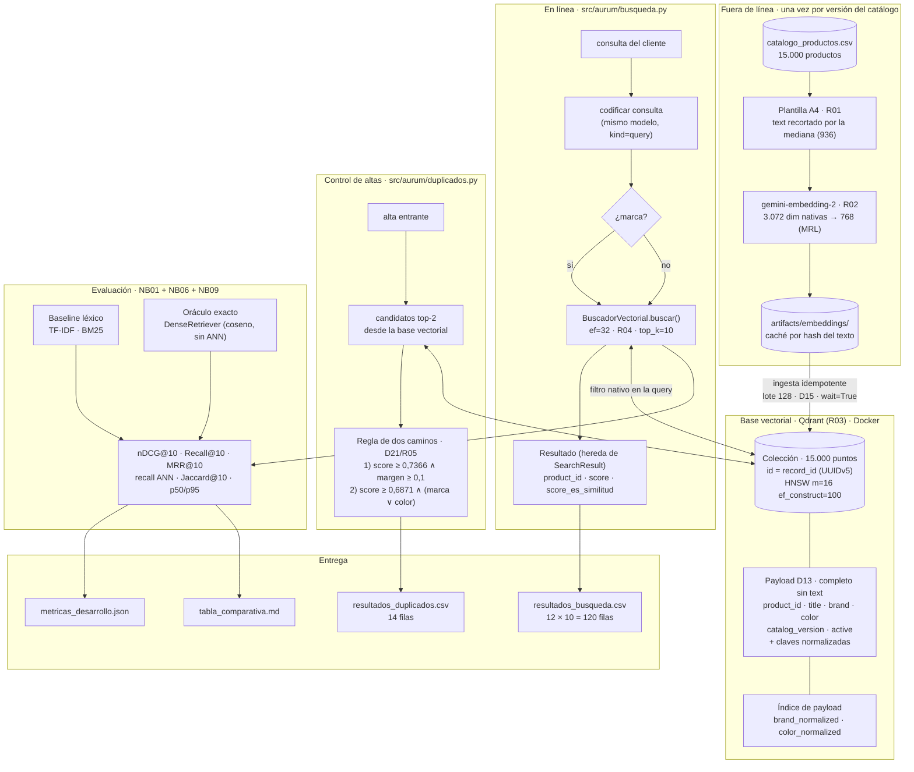

# Aurum Market: búsqueda semántica y control de catálogo

**Motor de descubrimiento y control de catálogo**

Repositorio: [https://github.com/RaulRX/aurum-market-catalog](https://github.com/RaulRX/aurum-market-catalog.git)
Autor: Raúl Sánchez Serrano

## Descripción del proyecto

Aurum Market es un motor de descubrimiento de productos sobre un catálogo de 15.000
referencias en español. El sistema resuelve dos recorridos: **búsqueda semántica** con
recuperación top-k y filtrado por marca ejecutado por la base de datos, y **control de
altas**, que detecta posibles productos duplicados al ingresar nuevas registros del catálogo en el
catálogo. La solución se apoya en una base de datos vectorial (embeddings + índice ANN)
y se compara en todo momento contra un baseline léxico, midiendo calidad del ranking,
fidelidad del índice, latencia, filtros, duplicados y mutaciones sobre la colección. No
se utiliza generación de texto ni LLM en tiempo de ejecución: todas las decisiones se
justifican con métricas y experimentos reproducibles.

---

## Índice

- [Contexto y objetivo](#contexto-y-objetivo)
- [Arquitectura del sistema](#arquitectura-del-sistema)
- [Estructura del repositorio](#estructura-del-repositorio)
- [Requisitos](#requisitos)
- [Instalación](#instalación)
- [Variables de entorno](#variables-de-entorno)
- [Datos](#datos)
- [Baseline léxico](#baseline-léxico)
- [Modelo de embeddings](#modelo-de-embeddings)
  - [D09 · Modelos comparados](#d09--modelos-comparados)
  - [D09b · Criterio de desempate](#d09b--criterio-de-desempate)
  - [D10 · Normalización y métrica](#d10--normalización-y-métrica--qué-significa-el-score)
  - [R02 · Qué está confirmado y qué no](#r02--qué-está-confirmado-y-qué-no)
- [Representación del texto](#representación-del-texto)
  - [D06 · Qué plantillas se compararon](#d06--qué-plantillas-se-compararon)
  - [D07 · Sin chunking](#d07--sin-chunking)
  - [R01 · Plantilla elegida](#r01--plantilla-elegida)
- [Motor vectorial](#motor-vectorial)
  - [D12 · Qué motores entran a la prueba de humo](#d12--qué-motores-entran-a-la-prueba-de-humo)
  - [R03 · Motor elegido](#r03--motor-elegido)
  - [D13 · Payload](#d13--payload)
  - [D14 · Nulos en el payload](#d14--nulos-en-el-payload)
  - [D15 · Tamaño de lote de ingesta](#d15--tamaño-de-lote-de-ingesta)
- [Recuperación y filtros](#recuperación-y-filtros)
- [Índice ANN](#índice-ann)
  - [D16 · Restricción de negocio](#d16--restricción-de-negocio)
  - [D17 · Sin laboratorio FAISS](#d17--sin-laboratorio-faiss)
  - [R04 · Valor de `ef`](#r04--valor-de-ef)
- [Detección de altas duplicadas](#detección-de-altas-duplicadas)
  - [D20 · Señales](#d20--señales)
  - [D21 · Forma de la regla](#d21--forma-de-la-regla)
  - [D22 · Criterio del punto de operación](#d22--criterio-del-punto-de-operación)
  - [R05 · Umbral elegido](#r05--umbral-elegido)
- [Mutaciones del catálogo](#mutaciones-del-catálogo)
  - [D18 · Estrategia de visibilidad](#d18--estrategia-de-visibilidad)
  - [D19 · Orden entre NB07 y NB08](#d19--orden-entre-nb07-y-nb08)
- [Evaluación consolidada](#evaluación-consolidada)
- [Configuración](#configuración)
- [Recorrido de notebooks](#recorrido-de-notebooks)
- [Comandos](#comandos)
- [Tests](#tests)
- [Resultados y artefactos](#resultados-y-artefactos)
- [Métricas y evaluación](#métricas-y-evaluación)
- [Visualizaciones](#visualizaciones)
- [Tiempos aproximados](#tiempos-aproximados)
- [Solución de problemas frecuentes](#solución-de-problemas-frecuentes)
- [Seguridad y limpieza de recursos](#seguridad-y-limpieza-de-recursos)
- [Licencia y procedencia de los datos](#licencia-y-procedencia-de-los-datos)

---

## Contexto y objetivo

El catálogo de Aurum Market son 15.000 productos en español procedentes de un volcado tipo ESCI: título comercial, marca, color y un campo `text` que arrastra la descripción del vendedor. Es un catálogo real, con la suciedad que eso implica — un 4,4 % de productos sin marca, un 37,4 % sin color, 9.054 marcas distintas para 15.000 referencias (1,7 productos por marca) y un `text` cuya mediana son 936 caracteres pero cuyo percentil 95 llega al tope de 3.000.

Sobre ese catálogo hay que resolver dos recorridos:

1. **Búsqueda semántica con filtro de marca.** Un cliente escribe lo que quiere como se le ocurre —`"sillas oficina ergonomicas"` o `"necesito un asiento cómodo para trabajar ocho horas"`— y el sistema devuelve diez productos, opcionalmente restringidos a una marca. El filtro lo ejecuta la base de datos, no un post-filtro en Python: `Einhell` son 30 productos de 15.000 (0,2 %), así que recuperar 100 candidatos y descartar los que no son de la marca puede devolver cero resultados.
2. **Control de altas duplicadas.** Cuando entra un producto nuevo, decidir si ya existe en el catálogo y señalar cuál. Los candidatos salen siempre de la base vectorial.

El objetivo de ingeniería no es "que funcione", sino que **cada decisión esté respaldada por un experimento medido**. Por eso el proyecto arranca con un baseline léxico (TF-IDF y BM25) contra el que justificar el coste de todo lo demás, y por eso hay 22 decisiones a priori (`D01`-`D22`) y 5 que dicta el dato (`R01`-`R05`), todas registradas en [`config/config.yaml`](config/config.yaml) con su evidencia.

**Fuera de alcance por el propio enunciado:** no se construye un RAG, no se genera texto y no se usa un LLM para resolver, etiquetar ni reordenar consultas en tiempo de ejecución. Los modelos de *embeddings* sí forman parte del problema.

## Arquitectura del sistema



Las tres piezas que sostienen la arquitectura, y por qué están donde están:

| Pieza | Dónde vive | Por qué |
|---|---|---|
| **La caché de embeddings** | `artifacts/embeddings/`, clave = hash del texto de origen | Codificar 15.000 productos cuesta dinero (API) o horas (local). La clave incluye el texto, así que cambiar de plantilla la invalida sola y no hay riesgo de servir vectores de otra receta |
| **El `record_id` como ID del punto** | Qdrant | Es un UUIDv5 estable que impone el propio dataset. Hace la ingesta idempotente *gratis*: reingerir el catálogo entero no duplica un solo punto |
| **La lógica en `src/aurum/`, no en los notebooks** | `src/aurum/*.py` + `tests/` | `pytest` no puede importar un notebook. Los notebooks importan y narran; las funciones se testean |

El oráculo exacto (`DenseRetriever`, coseno sobre los 15.000 vectores en memoria) no es parte del sistema entregado: existe para poder separar el error del índice del error de la representación, que es la distinción que sostiene toda la atribución de fallos de NB09.

## Estructura del repositorio

```
aurum-market-catalog/
├─ notebooks/            00_datos.ipynb … 10_entrega.ipynb — el núcleo de la entrega
├─ scripts/               build_notebook.py · execute_notebook.py · notebook_cells.py
│                         (construyen y ejecutan los notebooks a partir de Python plano,
│                          revisable y versionable — el .ipynb es un artefacto regenerable)
├─ src/aurum/              datos.py · lexico.py · embeddings.py · plantillas.py ·
│                          busqueda.py · evaluacion.py · graficas.py · almacen.py ·
│                          duplicados.py — la lógica que importan los notebooks
├─ tests/                 las pruebas mínimas exigidas (ids, batching, filtros,
│                          mutaciones, formato) más las que cubren la lógica sobre
│                          la que se apoyan las decisiones — que dos plantillas
│                          difieran en un solo factor, que la regla de desempate
│                          sea determinista, que una figura no mienta
├─ config/config.yaml     el registro de las decisiones D0x/R0x ratificadas
├─ artifacts/             comparativas y métricas intermedias — los .json y .md
│                          se versionan; artifacts/embeddings/ no (ver abajo)
├─ resultados/            resultados_busqueda.csv · resultados_duplicados.csv
├─ data/                  CSVs de entrada — no se commitea, ver sección Datos
├─ docker/docker-compose.yaml
├─ requirements.txt · pytest.ini · Makefile · .env.example · README.md
```

No forman parte de la entrega y están excluidos del repositorio (`.gitignore`): `data/` (los datos en sí), `docs/` (documentación de trabajo interna: plan, memorias de sesión, el enunciado), el entorno virtual `.venv/`, las cachés de herramientas (`__pycache__/`, `.pytest_cache/`), y el material de estudio de sesiones previas (`notebooks/sesiones/`, `src/vector_index_session/`, `src/vector_search_session/`) — se consulta como referencia, pero cualquier función que se reutilice de ahí se copia y adapta dentro de `src/aurum/`, nunca se importa directamente.

También queda fuera **`artifacts/embeddings/`**, y esa exclusión sí merece una explicación: son los vectores ya codificados de cada combinación de modelo, plantilla y corpus, y ocupan del orden de **1,7 GB** — varios ficheros superan por sí solos el límite de 100 MB por archivo de GitHub. Es caché regenerable: cada artefacto lleva en su nombre el SHA-256 del corpus de origen, así que basta con volver a ejecutar el notebook correspondiente para reconstruirla. Lo que sí se versiona son los `.json` y `.md` que cuelgan de `artifacts/`, que son los entregables que produce cada notebook.

## Requisitos

| | Mínimo | Notas |
|---|---|---|
| Python | 3.11+ | El desarrollo se hizo sobre 3.13 |
| RAM | 8 GB | Los modelos de embeddings y el motor vectorial compiten por ella; el motor se levanta de uno en uno |
| Disco | ~6 GB libres | ~1 GB de dependencias (`torch` incluido) + ~2,5 GB de pesos de los modelos descargados en la caché de Hugging Face + volúmenes de Docker |
| CPU | 4 núcleos | Toda la codificación es **CPU-only**; no se requiere GPU y el código no la usa |
| Docker | Desktop o Engine | Solo para el motor vectorial (a partir de NB04) |

El entorno de referencia de las mediciones que aparecen en este README es: Windows 10, Intel i5-6300HQ (4 núcleos / 4 hilos), 7,9 GB de RAM, sin GPU utilizable. Los tiempos dependen del equipo; las métricas de calidad, no.

> `torch` se instala desde PyPI sin índice adicional. En Windows la rueda oficial ya es CPU-only; en Linux, PyPI sirve la variante con CUDA, más pesada pero igualmente funcional en CPU. No hace falta configurar nada.

## Instalación

1. Clona el repositorio y sitúate en su raíz.
2. Crea el entorno virtual del proyecto y actívalo (nunca se instala nada en el intérprete global):

   ```bash
   python -m venv .venv
   # Windows
   .venv\Scripts\activate
   # Linux/Mac
   source .venv/bin/activate
   ```

3. Instala las dependencias congeladas:

   ```bash
   pip install -r requirements.txt
   ```

4. Registra el kernel de Jupyter, necesario para regenerar y ejecutar los notebooks con `scripts/execute_notebook.py`:

   ```bash
   python -m ipykernel install --user --name aurum-market-catalog --display-name "Aurum Market (.venv)"
   ```

5. Copia los ficheros de datos dentro de `data/` (ver sección [Datos](#datos)) — el directorio está vacío en el repositorio por diseño.

6. Verifica la instalación ejecutando los tests:

   ```bash
   pytest
   ```

## Variables de entorno

Se leen de un fichero `.env` en la raíz, que **no está versionado** (`.gitignore`). Copia `.env.example` y rellena solo lo que vayas a usar:

```bash
cp .env.example .env
```

| Variable | ¿Obligatoria? | Para qué |
|---|---|---|
| `GEMINI_API_KEY` | Solo para `gemini-embedding-2` | Medir su longitud en tokens (`count_tokens`) y generar sus embeddings. **Sin ella, esas celdas se omiten con un aviso y el resto del notebook se ejecuta igual** |
| `HF_TOKEN` | No, salvo repos *gated* | Descargar modelos de Hugging Face. Los tres candidatos actuales son de acceso abierto, así que solo hace falta si se añade un modelo con licencia aceptada (p. ej. la familia Gemma) |
| `LOCAL_EMBEDDING_MODEL` | No | Sobrescribe el modelo local por defecto sin tocar el código |
| `FAISS_NUM_THREADS` | No | Limita los hilos de FAISS en el laboratorio ANN (NB06) |

Ninguna clave aparece en el código, en los notebooks ni en sus salidas: se leen con `os.environ` tras `load_dotenv()`, y `.env.example` se mantiene siempre **sin valores reales**.

## Datos

Decisiones de negocio tomadas en NB00 sobre `catalogo_muestra.csv` (1.500 filas), con la evidencia real que las sustenta. Detalle completo, código y celdas en `notebooks/00_datos.ipynb` (regenerable con `python scripts/build_notebook.py 00_datos.ipynb` + `python scripts/execute_notebook.py 00_datos.ipynb`).

### D01 — Qué cuenta como "relevante" para Recall@10 y MRR@10

**Decisión: Exact + Substitute (E+S).** nDCG no se ve afectado (usa siempre el mapeo `E=3, S=2, C=1, I=0` del enunciado); esta decisión solo cambia el denominador de Recall@10 y MRR@10.

Denominador por consulta de desarrollo (`relevantes_solo_E` vs `relevantes_E_mas_S`):

| query_id | consulta | solo E | E+S |
|---|---|---:|---:|
| 13357 | base tapizada 160x200 sin patas | 4 | 31 |
| 18868 | botines marrones mujer tacon medio | 7 | 9 |
| 28703 | convertibles 2 en 1 portátil táctil | 25 | 39 |
| 31224 | cámaras bridge baratas | 5 | 15 |
| 33633 | disfraz halloween talla grande hombre | 1 | 4 |
| 38249 | estantes sin taladro habitación | 30 | 35 |
| 43240 | funda ipad air 4 sin tapa | 24 | 35 |
| 61533 | lentejas sin gluten | 25 | 30 |

**Por qué elegí esto:** elegí que Exact + Substitute cuenten como relevante para Recall@10 y MRR@10. Considero que un sustituto razonable es un resultado exitoso para el cliente, no solo el acierto exacto — es una decisión de negocio legítima sobre qué significa "servir bien" una búsqueda. Además, esta elección estabiliza la métrica: con solo Exact, la consulta 33633 se queda con un único ítem relevante (su Recall@10 solo puede valer 0 o 1) y la 13357 pasa de 31 a 4 relevantes — ese ruido pesaría demasiado al comparar configuraciones distintas en los notebooks siguientes.

### D02 — Política de nulos en el texto codificado

**Decisión: omitir la sección.** Si un campo (p.ej. `color`) está vacío, no se añade su sección al texto compuesto — en vez de dejar `"Color: ."` o insertar la palabra `"desconocido"`.

Evidencia (`null_field_rates` + `text_field_label_summary` sobre la muestra):

| campo | % nulos (estructurado) | % de `text` que ya menciona su etiqueta | de esas, con el campo estructurado vacío |
|---|---:|---:|---:|
| `brand` | 2,93 % (44/1.500) | 97,07 % dice "Marca:" | 0 |
| `color` | 36,60 % (549/1.500) | 66,73 % dice "Color:" | 50 |

El propio `text` de origen ya sigue esta política para `brand`: cuando `brand` está vacío, el texto **nunca** dice "Marca: ." (0 casos) — la sección simplemente no aparece. Confirma que "omitir" es coherente con el contrato de datos existente, no una convención nueva. Para `color` hay 50 filas donde el texto sí menciona "Color:" con el campo estructurado vacío — indicio de que `color` no es un campo limpio (ver también valores como `"Negro Black 333824 067"` en la distribución de valores), a vigilar si más adelante se decide enriquecer el texto con `color`.

**Por qué elegí esto:** decidí omitir la sección en vez de dejarla en blanco o escribir "desconocido" porque lo que me importa es el significado semántico del texto, no su longitud. Insertar la palabra "desconocido" en cientos de productos (36,60 % de `color` en la muestra) crearía una señal compartida artificial: el modelo podría acercar esos productos entre sí porque comparten literalmente esa palabra, no porque se parezcan como productos — es un riesgo de contaminación semántica del embedding. Soy consciente de que, al omitir la sección, pierdo la distinción entre "este producto no tiene color" y "no hacía falta mencionar el color"; con un 36,60 % de `color` vacío es un volumen grande, pero prefiero asumir ese coste antes que arriesgarme a meter ruido en el embedding.

**Puesta a prueba, y mantenida.** Tomé esta decisión razonando, sin medir, así que al comparar representaciones añadí una plantilla de **control** con la política invertida: la misma receta pero rellenando los campos vacíos.

Sobre la muestra de 1.500 la recuperación salía mejor con el relleno, pero al mirar dónde se producía esa mejora **no aplicaba sobre los vectores que realmente se rellenaban**: las consultas cuyos productos relevantes tenían el campo vacío no eran las que mejoraban, y la que los tenía *todos* vacíos —la exposición máxima posible— apenas se movía. Si la ventaja no viene de donde el relleno actúa, no es una ventaja de la recuperación. Sobre el catálogo completo, además, es la plantilla que peor escala de las siete.

Mantengo la política de omitir, ahora con una medición detrás en lugar de solo un razonamiento.

> 📓 `03_representacion.ipynb` → *El control de la política de nulos*, *¿Es señal o es perturbación?*

### D03 — Normalización de `brand` para el filtro nativo

**Decisión: `brand` se guarda y se embebe tal cual (raw), sin normalizar. La normalización (`strip` + `casefold` + sin acentos) se aplica solo en el momento de la búsqueda/filtro, no al dato almacenado.**

Sobre la muestra (1.500 filas, 1.191 marcas distintas) **ninguno de los tres modos produce colisiones** — la muestra no aporta evidencia a favor ni en contra de normalizar (`n_marcas_crudas` de `brand_normalization_collisions` da 0 grupos en los tres modos). Repetido sobre el catálogo completo (15.000 filas, 9.054 marcas distintas) para confirmarlo con certeza:

| modo | grupos con colisión | marcas fusionadas |
|---|---:|---:|
| raw | 0 | 0 |
| casefold | 66 | 133 |
| unaccent | 77 | 156 |

`casefold` funde variantes de mayúsculas/espacios de la misma marca (`Buffalo`/`BUFFALO`, `Bugatti`/`bugatti`, `Fortnite`/`FORTNITE`, `Rc Ocio`/`Rc ocio`/`RC OCIO`). `unaccent` añade 11 grupos más que solo se detectan al quitar acentos: `L'Oréal Paris`/`L'Oreal Paris`, `Nescafé`/`Nescafe`, `Nestlé`/`Nestle`, `Química Alemana`/`Quimica Alemana`, `Reig Martí`/`Reig Marti`, `Mühle`/`Muhle`. Revisando los grupos más grandes, ninguno parece una fusión indebida (marcas realmente distintas mezcladas) — todos son variantes tipográficas de la misma marca. Esto confirma la decisión con evidencia real sobre el catálogo completo, no solo sobre la muestra.

**Por qué elegí esto:** al principio pensé que normalizar `brand` podía afectar al embedding (que "Apple" se acercara semánticamente a "apple" la fruta), pero eso no aplica: `brand` se guarda y se embebe tal cual, sin normalizar, así que esta decisión no toca el embedding en absoluto. La normalización solo vive en el filtro de búsqueda, y su único objetivo es que un cliente no se quede sin resultados por escribir "nike" en vez de "NIKE", o por una variante de acentos. Descarté tocar la puntuación (apóstrofes incluidos) precisamente para no fusionar marcas que en realidad son distintas.

### D04 — Alcance de evaluación (nDCG/Recall/MRR)

**Decisión: un producto recuperado que no está entre los juicios de la consulta cuenta como Irrelevant (0), sin recolocar posiciones.** No es lo mismo que "muestra vs. catálogo completo" (eso ya está resuelto: desarrollo sobre la muestra, ejecución final sobre el catálogo completo) — D04 decide qué grado de relevancia recibe, en la puntuación, un producto que el motor devuelve pero que ningún humano llegó a juzgar.

Antes de decidir comprobé (`qrels_coverage_in_catalog`) que los productos juzgados por las 8 consultas de desarrollo sí existen en `catalogo_muestra.csv` (cobertura 100 %), así que Recall@10/nDCG calculados sobre la muestra son fiables — el hueco de evaluación no viene de ahí, sino de que solo 248 de los 15.000 productos tienen juicio humano (pools de 16 a 40 candidatos por consulta).

**Por qué elegí esto:** decidí marcar los productos no juzgados como Irrelevant (0) porque no quiero asumir, sin evidencia, que son buenos resultados — eso sería una suposición injustificada a favor del sistema. Es la opción conservadora: si nadie lo ha verificado, no le doy crédito por defecto. Además, es la práctica estándar en evaluación de sistemas de recuperación con pools parciales, y evita que la métrica se pueda inflar artificialmente con contenido nunca revisado.

## Baseline léxico

Decisiones tomadas en NB01, medidas primero sobre `catalogo_muestra.csv` (1.500 filas) y confirmadas después sobre el catálogo completo (15.000 registros) — las cifras de esta sección son las del catálogo completo. Detalle, código y celdas en `notebooks/01_baseline.ipynb`; métricas e IDs recuperados por consulta en `artifacts/baseline_lexico.json`.

### D05 — Qué baselines léxicos se implementan

**Decisión: TF-IDF + BM25.** Ambos comparten tokenizador (`aurum.datos.tokenize`), así que ven exactamente los mismos términos: entre ellos varía únicamente la fórmula de puntuación.

Dispersión de la longitud de documento (en tokens del propio tokenizador) — es el eje en el que ambos métodos se diferencian:

| campo | p50 | p95 | máx | cv | ratio p95/p50 |
|---|---:|---:|---:|---:|---:|
| `title` | 18 | 32 | 80 | 0,465 | 1,78 |
| `text` | 150 | 493 | 603 | 0,828 | 3,29 |

Techo del emparejamiento literal — % de productos relevantes (E+S) que contienen *todos* los términos de la consulta en el título:

| consultas de desarrollo | `pct_todos_en_title` |
|---|---:|
| 13357 · 18868 · 28703 · 31224 · 33633 · 38249 · 43240 | 0,0 % |
| 61533 (`lentejas sin gluten`) | 36,7 % |

Métricas sobre las 8 consultas de desarrollo (relevante = E+S según D01; no juzgado = 0 según D04):

| baseline | nDCG@10 | Recall@10 | MRR@10 | Precision@10 |
|---|---:|---:|---:|---:|
| TF-IDF | 0,4129 | 0,1510 | 0,750 | 0,4125 |
| BM25 | **0,5088** | **0,1841** | 0,750 | **0,5500** |

**Por qué elegí esto:**

- **TF-IDF** es la referencia léxica mínima y ya estaba disponible, sin coste añadido.
- **BM25** entra porque es el estándar en recuperación de información y porque es el único que trata la longitud del documento de forma distinta, saturando la repetición de términos y comparando cada registro del catálogo con la longitud media del corpus. Según las pruebas realizadas, el campo que indexo tiene una dispersión de longitud alta, así que esa diferencia no es teórica aquí: BM25 obtiene una ventaja clara en nDCG@10 sobre el catálogo completo.
- **LSA, descartado:** comprime la misma matriz de TF-IDF, así que no aporta una señal nueva sobre el corpus, y su papel de puente hacia lo denso lo cubre ya el modelo de embeddings de los notebooks siguientes.
- **Coincidencia exacta de título, descartada:** según las pruebas realizadas, prácticamente ningún producto relevante contiene todos los términos de la consulta en su título, así que devolvería resultados vacíos en casi todas las consultas.

### D05.b — Normalización de acentos en el tokenizador

**Decisión: se normalizan los acentos, con la misma normalización al indexar y al consultar.**

Frecuencia documental de los términos afectados — a cuántos registros del catálogo apunta cada palabra de la consulta, antes y después de normalizar:

| término (consulta) | sin normalizar | normalizando |
|---|---:|---:|
| `tactil` (28703) | 10 | **326** |
| `habitacion` (38249) | 19 | **434** |
| `tacon` (18868) | 16 | **140** |
| `portátil` (28703) | 919 | 946 |
| `cámaras` (31224) | 180 | 187 |

Las dos últimas filas son el contraste: las palabras que el usuario ya escribe con su tilde apenas se mueven. El efecto se concentra en las que llegan sin ella.

**Por qué elegí esto:** elegí normalizar los acentos en el tokenizador, aplicando la misma normalización al indexar y al consultar. Varias de las consultas de desarrollo se escriben sin tilde mientras el catálogo sí las lleva, y según las pruebas realizadas eso deja a esos términos apuntando a un puñado de registros del catálogo —casi siempre las mal escritas—, que por su rareza acaban decidiendo el ranking. Normalizar fusiona ambas listas y hace que consulta y catálogo se escriban en el mismo alfabeto.

### D05.c — Campo indexado

**Decisión: se indexa `text`, no `title`.** `text` es además la plantilla A0 con la que arranca la comparación de representaciones en NB02, de modo que léxico y denso se evalúan sobre la misma superficie textual.

La evidencia es la tabla de dispersión de D05: `title` tiene p50 de 18 tokens y un ratio p95/p50 de 1,78 (campo corto y homogéneo), frente a los 150 tokens de mediana y el ratio de 3,29 de `text`.

**Por qué elegí esto:** indexo `text` y no `title` porque `text` es la superficie completa del registro del catálogo y es la misma que usará el sistema denso como plantilla de partida, de modo que la comparación entre léxico y denso varía un único factor. Según las pruebas realizadas, `title` es además un campo corto y muy homogéneo.

## Modelo de embeddings

Elección del modelo que convierte cada producto en un vector. Compiten `gemini-embedding-2`, `jinaai/jina-embeddings-v3` e `ibm-granite/granite-embedding-311m-multilingual-r2` sobre el mismo texto, con un barrido de dimensiones. Detalle, código y celdas en `notebooks/02_modelo.ipynb`.

### Longitud en tokens y necesidad de chunking

Medida con el tokenizador real de cada modelo — no en caracteres ni en palabras, porque el límite de contexto se cuenta en piezas del vocabulario de cada modelo y esa cuenta no es la misma para todos.

Catálogo completo (15.000 registros), modelos locales:

| modelo | ventana | tokens p50 | p95 | máx | registros del catálogo que superan la ventana |
|---|---:|---:|---:|---:|---:|
| `jina-embeddings-v3` | 8.192 | 250 | 820 | 1.308 | **0 (0,00 %)** |
| `granite-311m-r2` | 32.768 | 242 | 789 | 1.972 | **0 (0,00 %)** |

Y cuántos registros del catálogo se truncarían con cada tamaño de ventana (tokenizador de jina):

| ventana | registros del catálogo que la superan |
|---:|---|
| 128 | 10.006 (66,71 %) |
| 512 | 4.167 (27,78 %) |
| 1.024 | 25 (0,17 %) |
| 2.048 | 0 (0,00 %) |

**Consecuencia:** con los tres modelos elegidos no se trunca ningún registro del catálogo, así que el chunking (multi-vector por producto) no resuelve ningún problema real. El punto de la base vectorial se mantiene en `record_id`, en relación 1:1 con el producto.

### ⚠️ Restricción de la medición de `gemini-embedding-2`

Gemini no publica su tokenizador, así que su longitud en tokens se mide llamando a `count_tokens` de la API. Eso impone dos límites que conviene conocer al leer las cifras:

1. **Es una petición de red por registro del catálogo**, de modo que se mide un subconjunto de **150 registros** (las 50 más largas en caracteres, más 100 aleatorias con semilla fija) en lugar del catálogo completo. Las 50 más largas son las únicas que podrían acercarse a la ventana, y el máximo observado (1.887 tokens) queda a más de 4× de los 8.192 disponibles: la conclusión no depende de esa precisión.
2. **Requiere `GEMINI_API_KEY`.** Sin clave, esa celda del notebook se omite con un aviso y el resto se ejecuta igual. `count_tokens` no consume cuota de facturación, pero sí cuenta para el límite de peticiones por minuto.

Sobre ese mismo subconjunto de 150 registros, los tres modelos dan: `gemini-embedding-2` máx. 1.887 tokens, `jina-v3` máx. 1.308 y `granite-311m-r2` máx. 1.875 — ninguno supera su ventana.

### D09 · Modelos comparados

**Decisión: compitieron `gemini-embedding-2`, `jinaai/jina-embeddings-v3` e `ibm-granite/granite-embedding-311m-multilingual-r2`. Gana `gemini-embedding-2`** —sin instrucción de tarea en el prompt, a 768 dimensiones— **por nDCG@10 sobre las 8 consultas de desarrollo**, la métrica primaria que fijé de antemano en el criterio de desempate.

§3.1 exige apoyar la elección en dos patas: las restricciones del caso y los resultados de desarrollo.

**Por qué compitieron estos tres.** Los filtré antes de medir, por cuatro restricciones del caso: son **multilingües** (el catálogo está en español y un modelo entrenado en inglés fragmenta el vocabulario); **caben en 4 núcleos sin GPU**, aunque los locales lo paguen en horas de CPU —incluí uno por API a propósito, para tener los dos regímenes de coste en la comparación en vez de dar el trade-off por supuesto—; están entrenados con **MRL**, que permite recortar dimensión sin recodificar; y **declaran contratos de entrada distintos**, que es lo que da contenido al eje de prefijos. La ventana de contexto no llegó a discriminar: los tres cubren el catálogo con holgura, y esa misma medición descartó el chunking.

**Por qué gana Gemini.** Es el único de los tres que **supera al baseline léxico**. Haber puesto BM25 como referencia —y no solo TF-IDF, más fácil de batir— es lo que dejó ver que la infraestructura vectorial no compensa por sí sola una representación deficiente. `jina-v3` cae por partida doble: es el peor de los tres y el único con licencia `cc-by-nc-4.0`, incompatible con un marketplace comercial.

Acepto a cambio una **dependencia de API**: cuota, condiciones que el proveedor puede cambiar y datos del catálogo saliendo de la máquina. `granite-311m-r2` era la alternativa limpia —Apache-2.0, pesos locales— pero no alcanza al léxico.

**El contrato depende de la dimensión:** retirar la instrucción ayuda con el vector grande y estorba al recortarlo mucho. La decisión vale para las 768 elegidas; habría que **revisarla, no heredarla**, si la memoria del índice obligara a bajar más.

> 📓 Medido en `02_modelo.ipynb` → *Longitud en tokens*, *Barrido de dimensión (MRL)*, *El contrato de entrada*, *El contrato no aporta lo mismo en todas las dimensiones* y *Contra el baseline léxico*


### D09b · Criterio de desempate

**Decisión: dentro de una tolerancia de 0,02 de nDCG@10, gana la configuración de menor dimensión.** Con ella, la elegida es `gemini-embedding-2` a **768 dimensiones**, cuatro veces más ligera que su dimensión nativa.

La regla se fijó **antes de codificar nada** y se aplica como función determinista cubierta por tests, no a ojo. Eso es lo que hace verificable la afirmación: el ganador sale de la tabla, no de una lectura interesada de ella.

1. `B` = mejor nDCG@10 de toda la tabla.
2. **Admisibles**: las que quedan a menos de 0,02 de `B`.
3. Entre las admisibles gana la de **menor dimensión**; a igualdad, mayor nDCG; después, menor tiempo de codificación.

**Por qué elegí esto:** con solo 8 consultas de desarrollo, una diferencia de nDCG por debajo de 0,02 no distingue dos sistemas — es ruido de muestreo, y dejar que decida el máximo sería fingir una precisión que no tengo. Prefiero declarar de antemano que, dentro de ese margen, manda el coste. La memoria del índice es una restricción real en esta máquina y se paga en cada consulta de por vida; unas milésimas de nDCG que no puedo defender estadísticamente, no.

El barrido lo confirmó: la calidad se mantiene plana mientras se recorta el vector y **solo se desploma pasado cierto punto**, así que la regla compró una reducción sustancial de memoria sin ceder calidad medible. El desempate por tiempo de codificación nunca llegó a usarse — la dimensión resolvió el orden.

> 📓 Medido en `02_modelo.ipynb` → *Barrido de dimensión (MRL)*, *Curva calidad ↔ dimensión* y *Aplicar el criterio de desempate*

### D10 · Normalización y métrica — qué significa el score

**Decisión: normalización L2 explícita, aplicada siempre al truncar, y `cosine` como métrica del motor.**

§3.1 pide *"explicar la relación entre la métrica configurada, la normalización y el significado del score"*, y §3.2 *"conservar la semántica del score nativo"*.

Con vectores de norma 1, las tres métricas candidatas —coseno, producto escalar y distancia euclídea— **producen exactamente el mismo ranking**: el producto escalar de dos unitarios *es* el coseno, y la distancia euclídea es una función decreciente de él. Sin normalizar, el producto escalar deja de medir parecido y empieza a premiar a los vectores largos; el coseno es el único inmune, porque normaliza por dentro.

**Por qué elegí esto:** si con vectores unitarios da igual cuál elija, entonces la elección no es de rendimiento sino de **seguridad**. Escojo la métrica que sigue significando lo mismo si la normalización fallara en algún punto del recorrido — al truncar, al reindexar o al cambiar de motor. Es defensa en profundidad: no gano nada hoy, pero no me juego el significado del score ante un fallo que sería invisible en las métricas.

La comprobación reveló algo que no esperaba y que justifica no delegar la normalización en el modelo: **de los tres candidatos, solo uno entrega vectores sin normalizar**, y es precisamente el único con el que este experimento demuestra algo. Si los tres normalizaran en origen, la verificación pasaría sin detectar nada. Basta una desviación de milésimas en la norma para reordenar resultados.

> 📓 Medido en `02_modelo.ipynb` → *Salud de los vectores* y *Normalización y métrica*

### R02 · Qué está confirmado y qué no

La elección del modelo se sostiene en tres comprobaciones. Dos están cerradas; la tercera, a medias — y prefiero decirlo que dejarlo implícito.

**✅ El contrato de entrada de `granite-311m-r2`.** Lo excluí del eje de prefijos porque su configuración declara los dos prompts vacíos, pero eso solo probaba que la librería no le añade nada, no que IBM lo entrenara sin instrucción — y §3.1 avisa de que no basta con citar la documentación del modelo. Revisé la model card completa, con todos sus backends y sus ejemplos de uso: **no documenta ninguna instrucción ni prefijo en ningún sitio**, y en su ejemplo de recuperación consultas y documentos se codifican por igual, a diferencia de las familias que sí llevan instrucciones. El contrato real es texto plano simétrico. `granite` no compitió en desventaja.

**✅ La fiabilidad de los tiempos.** Sospechaba de ellos como criterio de desempate (ver [Tiempos aproximados](#tiempos-aproximados)), pero nunca llegaron a usarse: la dimensión resolvió el orden antes.

**🟡 El comportamiento a escala real.** Todo el barrido corre sobre la muestra de 1.500 productos, y el enunciado evalúa sobre los 15.000. Recodifiqué al ganador sobre el catálogo completo y lo medí contra el baseline léxico: **el orden se mantiene** —el denso sigue por delante— aunque **la ventaja se estrecha**, y la mejora en cobertura es donde más se nota. La dimensión elegida se confirma: a escala real no solo ahorra memoria, rinde igual o mejor que la nativa.

Lo que **no** he confirmado a escala completa es el **orden entre los tres modelos densos**: recodificar los dos locales sobre 15.000 productos son decenas de horas de CPU. Con la distancia que les saca el ganador sobre la muestra, el riesgo de inversión es bajo — pero bajo no es cero, y lo dejo declarado como límite del experimento en lugar de darlo por supuesto.

> 📓 Medido en `02_modelo.ipynb` → *El ganador sobre el catálogo completo*

## Representación del texto

Con el modelo, la dimensión y la métrica ya congelados en el apartado anterior, aquí lo único que varía es **qué texto de cada producto se convierte en vector**. Detalle, código y celdas en `notebooks/03_representacion.ipynb`.

### D06 · Qué plantillas se compararon

**Decisión: siete recetas, desde el texto completo del producto hasta solo el título.** Entre medias, tres composiciones a partir de los campos estructurados —con etiquetas, sin ellas y sin `color`— y un recorte del texto por la mediana de longitud del catálogo.

**Por qué elegí esto:** quería cubrir el rango entero en vez de probar dos variantes parecidas. Los extremos acotan el problema —si el texto largo fuera puro relleno ganaría el título solo; si cada campo aportara, ganaría la composición más completa— y las intermedias dicen dónde está el punto de corte.

Añadí una séptima como **control, no como candidata**: la misma receta que una de las composiciones pero rellenando los campos vacíos, para poner a prueba la política de nulos que había decidido razonando y sin medir. Su papel quedó declarado antes de codificar nada, y por eso no compite por ser la elegida aunque puntúe.

El punto de corte del recorte **no lo elegí yo**: sale de la mediana de longitud del propio catálogo. Un número escrito a mano habría sido una decisión disfrazada de detalle de implementación, imposible de defender frente a cualquier otro valor.

> 📓 `03_representacion.ipynb` → *Las siete plantillas*, *De dónde sale el recorte*

### D07 · Sin chunking

**Decisión: un vector por producto, sin partir el texto en trozos.**

**Por qué elegí esto:** el chunking resuelve un problema que aquí no existe. La medición de longitudes en tokens del apartado anterior mostró que ningún registro del catálogo se acerca a la ventana de contexto de los modelos candidatos, con un margen de más de cuatro veces. Partir en trozos habría multiplicado los vectores, obligado a deduplicar por producto antes de cortar el top-10 y complicado la idempotencia con fragmentos huérfanos al actualizar — todo a cambio de nada.

Se descarta **por medición, no por falta de tiempo**, y eso deja el esquema simple: el punto de la base vectorial es `record_id`, en relación 1:1 con el producto.

> 📓 `02_modelo.ipynb` → *Longitud en tokens*, *Cuántos registros se truncarían*

### R01 · Plantilla elegida

**Decisión: el texto del producto recortado por la mediana de longitud del catálogo**, algo más de la mitad del original. Gana por **nDCG@10 sobre las 8 consultas de desarrollo** y es la única que entra en la tolerancia de 0,01 que fijé antes de ver ningún resultado.

**Por qué elegí esto:** decidí sobre el catálogo completo y no sobre la muestra, y esa distinción no es un detalle — **la muestra me habría llevado a otra plantilla**. Con 1.500 productos ganaba la más corta, solo el título; con los 15.000 reales el orden se da la vuelta y el recorte por la mediana pasa a primera. Eso solo se ve midiendo a escala real, y equivocarse ahí obliga a recodificar el catálogo entero y a reconstruir el índice.

Me quedo con el recorte porque **con la mitad del contenido conservo la información que hace falta para recuperar**: el resto era, en buena parte, prosa comercial que diluía el vector. Y el punto de corte no lo elegí yo — sale de la mediana de longitud del propio catálogo, así que es una regla que se recalcula sola si el catálogo cambia, no un número puesto a dedo que habría que defender frente a cualquier otro.

Asumo un **riesgo conocido**: recortar por longitud da por hecho que lo importante va al principio de la ficha. Si en algún producto la descripción deja para el final los detalles que lo distinguen, ese recorte los pierde. No lo he medido, y queda declarado como límite.

**Por qué el orden cambia al escalar:** con diez veces más candidatos compitiendo por las mismas diez posiciones, una representación de un centenar de caracteres se queda sin con qué separar vecinos próximos, mientras que una larga conserva los detalles que desempatan. Las dos plantillas más largas son las que menos se degradan; las cortas, las que más.

> ⚠️ La segunda clasificada queda fuera de la banda por poco más de una milésima. Son dos plantillas prácticamente empatadas y la regla las separa por un margen muy fino: conviene tenerlo presente si más adelante cambia algo del recorrido.

> 📓 `03_representacion.ipynb` → *El barrido*, *El barrido sobre el catálogo completo*


## Motor vectorial

Decisiones tomadas en NB04. A diferencia de NB02 y NB03, aquí el corpus por defecto es el **catálogo completo**: la prueba de humo se hace sobre `catalogo_muestra.csv` (1.500), pero el índice definitivo se construye con los 15.000. Detalle y celdas en `notebooks/04_motor.ipynb`; tabla de humo en `artifacts/comparativa_motores.md`.

### D12 — Qué motores entran a la prueba de humo

**Decisión: Qdrant, Weaviate y Milvus.** Orden de preferencia previo — Qdrant, Weaviate, Milvus — declarado como expectativa, no como resultado: R03 sale de la tabla, y si la contradice manda la tabla.

Dos filtros para entrar: el requisito duro de buscar texto **dentro de un campo de metadatos**, y el coste operativo en una máquina de 7,9 GB.

| Motor | Estado | Motivo |
|---|---|---|
| Qdrant | ✅ entra | Cumple el requisito duro y es el más barato de operar |
| Weaviate | ✅ entra | Cumple; esquema tipado, más ceremonia |
| Milvus | ✅ entra | Tres contenedores en 7,9 GB, justo lo que el plan marca como pesado. Se levanta el último y solo |
| Chroma | ❌ fuera | Su `contains` busca en el documento entero, no dentro de un campo |
| pgvector | ⏸️ aplazado | Cumple todo, pero reabriría D14 |
| FAISS | ❌ nunca fue candidato | No es un motor: no persiste metadatos y su HNSW no admite borrado arbitrario |
| Pinecone | ❌ fuera | Cloud: el corrector no puede heredar costes |

**Por qué elegí esto:** Chroma cae por mi condición de filtrar por color. Su `contains` no busca dentro de un campo de metadatos sino en el documento entero, y eso no es filtrar por color: casaría con productos cuyo título dice "negro" pero cuyo color es otro. No alcanza menos, alcanza mal. FAISS nunca fue candidato — es un generador de índices, no un motor: no persiste metadatos y su HNSW no admite borrado arbitrario, que son dos de mis condiciones no negociables; su sitio es NB06, como oráculo exacto. Pinecone queda fuera por el enunciado y no por mí: es cloud, y el corrector no puede heredar costes ni abrirse una cuenta — su filtro de metadatos tampoco tiene subcadena, así que habría caído igual.

A pgvector no lo descarto, lo **aplazo**: cumple todos los requisitos, pero con tres motores medidos tengo suficiente para arrancar. Y meterlo no sería añadir un adaptador más — el payload pasaría a ser columnas y D14 se reabriría, porque en SQL `''` y `NULL` no son lo mismo. Queda abierto.

A Milvus lo dejo entrar aun sabiendo que son tres contenedores en 7,9 GB: descartarlo por la etiqueta en vez de por una medición propia es exactamente lo que el enunciado (§3.1) prohíbe.

### R03 — Motor elegido

**Decisión: Qdrant.** A la vista de los 10 pasos de la prueba de humo contra los tres motores, del nivel de `contains` de cada uno, y de los seis criterios de arquitectura de `sesion_01` — de los que memoria del índice y dependencia del proveedor son los que más se mueven al elegir motor.

**Por qué elegí esto:** elijo Qdrant. Es el único que cumple el requisito duro sin pagar el precio de la subcadena: filtra por palabras, así que `rosa` no arrastra `rosado` como sí haría un motor de nivel 3. La necesidad de `contains` nace de que `color` es texto libre, y de esa misma suciedad viene la limitación morfológica (`negro` / `negra`), que sigue ahí — pero la tienen los tres, no es un defecto de este.

Además es el único que informa del estado de indexación, que §3.2 pide verificar antes de aceptar consultas. Su consumo de RAM y su coste de ingesta son asumibles — 36,4 MiB en un único contenedor —, trae panel web propio y usable, y no tiene coste de suscripción. Queda por comparar qué añadiría una versión de pago, pero eso no condiciona esta entrega.

**Lo que no pesa en la decisión:** el coste cero no elige. Los tres son open source y autoalojados, así que cumplen el presupuesto por igual. Lo anoto para que no se lea como un argumento a favor de Qdrant cuando no distingue a nadie.

**Dónde pierde el elegido:** en el paso 9. Con el motor caído, Qdrant sube `grpc.RpcError` en vez de una excepción propia del SDK. Es una clase pública y el mensaje es descriptivo (UNAVAILABLE, puerto y conexión rechazada), así que cumple el criterio; lo que pasa es que **el tipo depende del transporte**. El adaptador habla gRPC por el 6334 y por REST la excepción sería otra, de modo que el error tipado de NB05 tiene que envolver los dos casos.

### D13 — Payload

**Decisión: completo, sin `text`.** Campos: `product_id`, `title`, `brand`, `color`, `catalog_version`, `active`, más las claves normalizadas (`brand_normalized`, `color_normalized`) que sostienen el filtro.

**Por qué elegí esto:** completo sin `text`, porque el porcentaje sobre los vectores es muy superior llevándolo. Y para los metadatos, el texto es en su mayoría descripción que no aporta lo que buscamos aquí.

**Matiz importante para no malinterpretar la decisión:** NB03 midió que A4 —el `text` recortado por la mediana— *gana* a las plantillas cortas, así que el texto sí lleva significado. Lo que sostiene la decisión es otra cosa: ese significado **ya está en el vector**, y copiarlo al payload solo serviría para reconstruir el índice sin el CSV.

**Nota técnica:** la opción `mínimo` no llegó a competir, y no por preferencia — la descartan los notebooks posteriores. NB05 necesita `title` (§3.3 exige devolverlo), NB08 necesita `catalog_version` y `active`, NB07 necesita `title` y `color`. `text` es el único campo que nadie vuelve a abrir.

**Índice de payload sobre las claves normalizadas:** `Einhell` son 30 productos de 15.000 (0,2 %). Con 9.054 marcas, un filtro sin índice recorre el catálogo entero para devolver treinta puntos.

### D14 — Nulos en el payload

**Decisión: cadena vacía.** Afecta a `brand` (4,39 % vacío) y `color` (37,39 % vacío, más de 5.600 productos).

**Por qué elegí esto:** conviene más tener el campo pero vacío, porque de esa manera podremos obtenerlos listando aquellos que no tengan una marca definida.

> ⚠️ **Ojo, D14 contradice a D02 y es a propósito.** D02 decidió *omitir* la sección en el **texto que se codifica**; D14 decide *dejar la cadena vacía* en el **payload que se almacena**. Son dos sitios distintos: en el texto, un hueco declarado contamina el embedding; en el payload, un hueco declarado es consultable.

**Consecuencia que hereda NB05:** un `contains ""` casa con todo. Si la consulta llega vacía y el filtro se construye sin validar, **deja de filtrar en silencio**. Es validación de entrada, y §3.3 la pide con todas las letras.

### D15 — Tamaño de lote de ingesta

**Decisión: 128.**

**Por qué elegí esto:** son fallos más pequeños, pero con lotes pequeños hay más envíos y el porcentaje de reenvíos aumenta por el número. Elijo 128 para estar en un término medio: ni un número grande de fallos ni un límite cercano.

**Lo que D15 no decide:** la RAM. El plan planteaba esta decisión como un problema de memoria, pero en NB04 el modelo no se carga — los vectores vienen hechos desde `artifacts/embeddings/`. A 3.072 bytes por vector, el lote de 256 ronda el megabyte y la memoria no arbitra.

**La aritmética:** el trabajo perdido *esperado* no depende del lote — `(15.000 / lote) × p × lote = 15.000 × p`. Con el lote pequeño cambian el peor caso por incidente y la variabilidad, no el coste esperado. Con 128 son 118 peticiones frente a 235 con 64, y el mensaje queda muy por debajo del máximo de gRPC (4 MiB).

## Recuperación y filtros

Decisiones de NB05. No hay `D` numeradas aquí: son decisiones de diseño de la interfaz pública del sistema, registradas igualmente en `config.yaml` → `nb05_recuperacion`. Código en [`src/aurum/busqueda.py`](src/aurum/busqueda.py).

**Forma del resultado — decisión: un tipo nuevo que hereda del existente.**

**Por qué elegí esto:** un tipo nuevo, pero que extienda del existente para reutilizar las propiedades necesarias para devolverlo. Y para llevar la información de un tipo a otro, tiene que haber un mapeo entre los dos objetos.

`Resultado` hereda de `SearchResult`, así que **es** un `SearchResult`: la evaluación, las gráficas y la tabla comparativa de NB09 lo aceptan sin convertir nada. El mapeo que sí hace falta está en la otra costura —del `SearchHit` del motor al `Resultado`— y es donde se saca `product_id` del payload. Sin ese campo no se puede escribir `resultados_busqueda.csv`, así que su ausencia es un error, no un hueco.

> Nota técnica: `SearchResult` es `frozen` y con `slots`, así que `Resultado` tiene que serlo también —Python no permite heredar entre `frozen` y no `frozen`— y todos sus campos nuevos necesitan valor por defecto, porque el padre ya tiene uno.

**Casos borde:**

| Caso | Comportamiento | Por qué |
|---|---|---|
| Colección vacía | Lista vacía | A nivel de usuario, cuando busque, no le aparecerá nada si no se encuentra nada |
| Filtro sin resultados | Lista vacía | No se decide: lo impone el enunciado |
| Motor no disponible | Excepción tipada | No es el mismo caso que no haber encontrado resultados |
| `top_k` > nº de puntos | Devuelve lo que haya | — |

**Timeout — decisión: 30 s.**

**Por qué elegí esto:** 30 segundos para la búsqueda, y si se supera, una excepción controlada. No es el mismo caso que no haber encontrado resultados.

**Contraste medido:** la búsqueda sobre el índice de 15.000 tarda 22 ms, así que el tope está 1.400 veces por encima de lo típico. Eso lo hace muy seguro contra falsos positivos —una primera consulta en frío no lo dispara nunca— a cambio de que un usuario espere 30 s antes de enterarse de que el motor no está.

**Filtro por color en la interfaz — decisión: no se expone.**

**Por qué elegí esto:** el color debe constar únicamente como filtro de búsqueda, pero no es requisito que se exponga a la interfaz (de momento). Queda como capacidad del almacén —índice de texto declarado y probado en NB04— sin puerta de entrada pública. Exponerlo más adelante es añadir un parámetro, no rehacer el índice.

## Índice ANN

Decisiones de NB06. Barrido de `ef` sobre la colección de 15.000, con el oráculo exacto (`DenseRetriever` local) como referencia. Resultados en `artifacts/benchmark_ann.csv`.

> 🚨 **La distinción que sostiene todo este apartado:** `recall ANN@10` mide si el **índice** es fiel al espacio vectorial; `Recall@10` mide si la **representación** es buena. Un ANN puede tener recall 1,0 y una relevancia pésima: reproduce fielmente un espacio mediocre.

### D16 — Restricción de negocio

**Decisión: `recall ANN ≥ 0,90` y `p95 ≤ 20 ms`.** Es la opción *permisiva* de las tres que se plantearon (equilibrada 0,95/50 ms · estricta 0,98/100 ms · permisiva 0,90/20 ms).

**Por qué elegí esto:** priorizo velocidad, asumiendo que la comparación de nDCG@10 entre el oráculo y el ANN elegido es la que dice de verdad si esa pérdida de recall le cuesta algo al negocio. El recall del índice por sí solo no es una métrica de negocio.

**Por qué se fija antes de ver la curva:** si se mira primero la curva y después se dice "con esto me vale", la restricción deja de ser un criterio de decisión y pasa a **describir el resultado en vez de juzgarlo**. Mismo patrón que D09b y D22.

### D17 — Sin laboratorio FAISS

**Decisión: no.** NB06 se limita al motor de entrega (Qdrant, R03): barrer `ef` y medir recall, latencia y nDCG contra el oráculo exacto. Es lo que exige el enunciado; comparar familias ANN (IVF, IVF-PQ) queda fuera de alcance.

**Parámetros de construcción — `m=16`, `ef_construct=100` (los de por defecto de Qdrant).**

**Por qué elegí esto:** tomemos `m` y `ef_construct` por defecto, aunque sería una buena mejora a futuro el configurarlos con diferentes tamaños de colecciones. Cambiarlos exige una colección nueva al lado (`HnswConfigDiff` se declara al crear), y por eso el barrido solo toca `ef` (`hnsw_ef`), que es un parámetro **de consulta** y no reconstruye nada.

### R04 — Valor de `ef`

**Decisión: `ef = 32`.** Barrido sobre `{16, 32, 64, 128, 256}`.

| | valor |
|---|---:|
| `recall ANN@10` (media) | 0,90 |
| `recall ANN@10` (mínimo) | 0,00 |
| p50 | 7,04 ms |
| p95 | 9,01 ms |
| QPS estimado | 142,1 |

**Por qué:** de las configuraciones que cumplen D16 (32, 64, 128 y 256), la 32 es la de **menor p95 medido** (9,01 ms) — el coste real, no el supuesto de que más `ef` siempre tarda más. Empata con el recall mínimo justo en el umbral (0,90), pero la comparación de nDCG contra el oráculo confirma que esa igualdad no esconde nada grave.

**El caso duro — consulta 18868.** La media de recall esconde que **una** consulta (`"botines marrones mujer tacon medio"`) tiene recall 0: no encuentra ninguno de los 10 vecinos exactos, mientras las otras 19 del barrido van bien. Se investigó si era un fallo estructural o densidad de la región:

- **Descartado bug de normalización o de caché:** el vector de consulta cacheado por lote y el cacheado suelto para ese texto exacto son idénticos bit a bit, coseno 1,0.
- **Confirmada la densidad:** reejecutando solo `ef=128`, la 18868 se recupera del todo (10 de 10) y aparece *otra* consulta distinta como la más difícil. El problema no es `ef=32`: es que la categoría "botines de mujer" ocupa una región muy densa del catálogo.

**Lo que cuesta en nDCG:** sobre las 8 consultas con juicios, el nDCG@10 agregado baja de 60,06 % (oráculo) a 55,31 % (R04) — **4,75 puntos**. Por consulta, la 18868 es la única que empeora, y lo hace del todo (45,0 % → 0,0 %); seis no se mueven ni un punto y una (la 33633) *mejora* +7,0 %, porque el ANN trajo un sustituto más relevante que el vecino exacto según los juicios reales. **El 100 % del coste de R04 lo paga una sola consulta.**

**Ruido medido y descartado:** en una ejecución del barrido, `ef=64` registró un p95 anómalo (32,29 ms, por encima incluso de `ef=128` y `ef=256`). Se reprodujo aislando esa configuración sola y volvió a los ~8-12 ms esperados. Conclusión: ruido del sistema durante ese tramo del barrido, no una propiedad de `ef=64`. No afecta a R04 porque `ef=32` ya ganaba por p95 antes de esa anomalía.

**Conclusión para el informe:** `ef=32` es prácticamente gratis salvo en un caso identificado y explicado. No es "`ef` bajo no sirve" en general — 6 de las 8 consultas van perfectas incluso con `ef=32`, y una hasta mejora: es un fallo localizado, no sistémico.

## Detección de altas duplicadas

Decisiones de NB07, calibradas **solo** sobre `altas_desarrollo.csv` (14 casos, 7 positivos y 7 negativos). Los candidatos salen siempre de consultar Qdrant, nunca de recalcular en local. Artefacto: `resultados/resultados_duplicados.csv`.

### D20 — Señales

**Decisión: `score_top1`, `margen (top1 − top2)`, coincidencia de marca y coincidencia de color.**

**Descartada — similitud léxica de título** (`rapidfuzz` / Jaccard de trigramas): el `score_top1` del embedding semántico ya debería cubrir el caso de títulos reordenados del enunciado, y añadir un cuarto parámetro continuo sobre solo 14 ejemplos de desarrollo subía el riesgo de sobreajuste sin necesidad clara.

**Limitación de la señal de marca:** el campo `text` codificado no es fiable para extraer la marca — `DEV-DUP-001` llega con `brand="NIKE"` en el payload pero su texto dice `"Marca: ."`. Por eso la señal usa el **payload**, no el texto. Aun así, el payload tiene un 4,4 % de productos (658/15.000) sin `brand`, y en esos casos el corroborador de marca no puede activarse.

**Limitación de la señal de color:** `color` está vacío en el 37,4 % del catálogo. La igualdad se calcula sobre el **conjunto de palabras normalizado** (minúsculas, sin acentos, separado por comas, "y" o "/"), no por subcadena ni solapamiento parcial: `"Negro, Acero Inoxidable"` y `"Acero Inoxidable, Negro"` coinciden (mismas palabras, otro orden), pero `"Negro y Blanco"` **no** coincide con `"Negro"` — un color declarado de más es información distinta, no la misma dicha de otra forma.

### D21 — Forma de la regla

**Decisión: dos caminos en OR.**

```
Camino 1:  score_top1 ≥ umbral_texto_solo        ∧  margen ≥ margen_minimo
Camino 2:  score_top1 ≥ umbral_texto_corroborado ∧  (marca coincide ∨ color coincide)

con  umbral_texto_corroborado < umbral_texto_solo
```

**Por qué dos caminos:** el color nunca debe bloquear un duplicado por sí solo — "mismo pantalón, otra talla o color" puede contar como duplicado. El Camino 1 no depende de marca ni de color. El Camino 2 corrobora los casos donde la similitud semántica sola no basta.

**Por qué OR y no AND:** un AND entre marca y color exigiría que ambos campos estén presentes **y** coincidan a la vez; con un 37,4 % de color vacío y un 4,4 % de marca vacía, eso bloquearía el Camino 2 en una fracción no despreciable de candidatos reales, en contra de D22. Pero además es una decisión consciente, no solo un parche por datos faltantes: misma marca con distinto color ya debe corroborar duplicado — es la misma variante de producto —, no descartarlo.

> ⚠️ **Limitación declarada del Camino 2:** no es calibrable con los 14 ejemplos de desarrollo. Los 7 positivos son reenvíos casi literales (texto, marca y color idénticos) que ya caen en el Camino 1 con cualquier `umbral_texto_solo` razonable. **Ningún ejemplo activa el Camino 2 en solitario.** Por eso `umbral_texto_corroborado` se fija por criterio razonado, no por barrido. Lo ideal sería verificarlo con más datos —casos de corroboración por marca o color sin texto casi idéntico—, pero no se dispone de ellos.

### D22 — Criterio del punto de operación

**Decisión: maximizar recall con un suelo de precisión.** El suelo se expresa como **máximo 2 falsos positivos sobre los 7 negativos** de desarrollo, no en decimales: con solo 7 negativos, cualquier cifra con dos decimales es precisión falsa — un solo ejemplo mal clasificado mueve la métrica 12-14 puntos.

**Por qué priorizo recall:** los falsos negativos (duplicados no detectados) degradan el top-10 de búsqueda con variantes redundantes del mismo producto, desplazando resultados buenos y distintos fuera del ranking. Sin un proceso que reaudite el catálogo ya publicado, es un fallo **silencioso y persistente**. Un falso positivo, en cambio, se corrige en el acto con una revisión manual en el momento del alta.

**Por qué se fija antes de ver la curva:** mismo patrón que D09b y D16 — si el suelo se elige después, deja de ser un criterio de decisión y pasa a describir el resultado.

### R05 — Umbral elegido

**Decisión:**

| parámetro | valor | origen |
|---|---:|---|
| `umbral_texto_solo` | 0,7366 | barrido |
| `umbral_texto_corroborado` | 0,6871 | criterio razonado |
| `margen_minimo` | 0,1 | **override manual** (ver aviso) |

Sobre desarrollo: precisión 1,0 · recall 1,0 · F1 1,0 · 0 falsos positivos, de 216 combinaciones evaluadas (rango derivado del `score_top1` observado en las 14 altas, no de un valor de libro).

> ⚠️ **El `margen_minimo` no lo eligió el barrido.** El barrido devolvió 0,0, pero no por mérito propio: empata con cualquier otro candidato, porque las 7 altas positivas tienen `marca_coincide=True` y ya superan `umbral_texto_corroborado` por sí solas — el Camino 2 las atrapa sin necesitar el margen. El barrido eligió 0,0 por ser el primer candidato de un empate. Subirlo no cuesta nada medible en este dataset y añade protección real, así que lo fijo manualmente en **0,1**: es el margen más alto visto entre los 7 negativos de desarrollo (0,0577, `DEV-NEW-001`) redondeado al alza — el "ruido" que existe aunque no haya ningún duplicado real. Descarté 0,2 —más conservador, pero dejaría el Camino 1 dependiendo casi siempre del Camino 2— para no perder de vista que el margen debe seguir aportando algo por sí solo.

> ⚠️ **Precisión = recall = F1 = 1,0 no significa que la regla generalice.** Es coherente con el propio dataset: los 7 positivos son reenvíos casi literales y los 7 negativos son productos de categorías completamente distintas — no hay ni un caso limítrofe en desarrollo. No debe leerse como evidencia de que funciona en los casos difíciles (variantes, paráfrasis) que el conjunto no contiene.

Reejecutado con el override aplicado: **7 de 14** marcadas como duplicado sobre `altas_evaluacion.csv`, el mismo recuento que con `margen_minimo=0,0`, confirmando que el override no cambia el resultado en ninguno de los dos conjuntos.

## Mutaciones del catálogo

Decisiones de NB08: los 24 eventos de `eventos_catalogo.csv` (8 actualizaciones, 8 altas, 8 bajas). El objetivo es demostrar **idempotencia y visibilidad**, no cronometrar. Traza completa en `artifacts/mutaciones.json`.

### D18 — Estrategia de visibilidad

**Decisión: espera activa con timeout, en la lectura.**

**Por qué elegí esto:** sí, hagamos una espera activa. La escritura ya es síncrona (`QdrantStore.upsert(..., wait=True)`, fijado desde NB04); D18 añade una segunda espera, la de la **lectura**: la verificación por búsqueda vectorial reintenta hasta un tope de tiempo y falla con mensaje claro si el punto no aparece, en vez de asumir que `wait=True` en la escritura basta para que el índice HNSW ya lo refleje.

El enunciado (§4.1) pide que el sistema "sepa esperar, fallar o informar" también en las rutas de lectura. NB04 midió que el índice puede tardar varios segundos en reflejar una ingesta grande; para un upsert pequeño es plausible que sea instantáneo, pero D18 **lo mide en vez de suponerlo**.

### D19 — Orden entre NB07 y NB08

**Decisión: NB07 (duplicados) se ejecuta ANTES que NB08 (mutaciones).**

**El hallazgo que lo motiva:** 7 de las 14 filas de `altas_desarrollo.csv` (las `DEV-DUP-001..007`) traen un `reference_product_id` que coincide exactamente con 7 de los 8 `product_id` que las actualizaciones `EVT-001..008` modifican. Solo `EVT-007` —el delantal infantil— no tiene un alta que lo referencie.

**Por qué elegí esto:** mejor no tentar a la suerte y hacer la prueba de duplicados frente al catálogo real, antes de que `eventos_catalogo` lo module. Aunque no tenga por qué pasar, es más seguro no arriesgarse a perder la referencia original con la que se diseñó el examen de NB07.

`altas_desarrollo.csv` nunca se inserta en el catálogo: es un examen (14 casos con respuesta conocida), no dato de producción. Desde el renumerado, el nombre del fichero ya coincide con el orden real — antes el examen de duplicados se llamaba `08_duplicados.ipynb` y corría primero pese al número.

**Por qué no vale cachear los vectores aparte:** el enunciado (§4.2) exige que "la base vectorial siga siendo el mecanismo de generación de candidatos". No basta con recalcular en local contra los vectores cacheados, porque eso dejaría de probar el motor de verdad. La única forma de calibrar contra el catálogo "de antes" es **consultar Qdrant antes de que NB08 lo mute**, no evitar Qdrant.

## Evaluación consolidada

NB09 no toma decisiones: las 22 `D` y las 5 `R` estaban cerradas al llegar aquí. Reúne lo que midieron NB01-NB08, genera los artefactos de entrega y atribuye los fallos. Todo lo que sigue quedó registrado en `config.yaml` → `nb09_evaluacion` como **trabajo extra de verificación**, no como decisiones nuevas.

### Una corrección de la propia medición

Al verificar los fallos se detectó que **el oráculo y el índice no contenían el mismo catálogo**. NB08 aplicó 24 eventos sobre Qdrant, pero el oráculo se seguía construyendo desde `catalogo_productos.csv`, la foto anterior. Ambos suman 15.000 puntos y no son los mismos: 8 bajas y 8 altas de diferencia. Y varias de esas altas responden literalmente a consultas de desarrollo — `AURUM-NEW-008` se titula *"Base tapizada 160 x 200 sin patas"*, que **es** la consulta 13357. El ANN las devolvía y la métrica lo apuntaba como pérdida suya.

No es una decisión de diseño: es un defecto de la medición, detectado al comprobar por qué subir `ef` no recuperaba nada. Se recalculó el oráculo sobre el corpus post-NB08 y se repitió la comparación:

| oráculo | nDCG@10 oráculo | nDCG@10 ANN | brecha |
|---|---:|---:|---:|
| pre-NB08 | 0,6006 | 0,4787 | 0,1219 |
| post-NB08 (mismo corpus que el índice) | 0,5262 | 0,4787 | **0,0475** |

**El 61 % de la pérdida atribuida al ANN era diferencia de corpus, no aproximación.** La cifra corregida se valida sola: 0,0475 es exactamente la brecha que midió NB06 (−4,75 puntos) cuando aún no existía ninguna mutación. Las altas hunden por igual al oráculo y al ANN —no tienen juicio y por D04 puntúan 0—, así que la brecha se conserva. Dos mediciones independientes, separadas por tres notebooks y 24 eventos de escritura, dan el mismo número.

### Atribución de fallos — uno por capa

| Consulta | Capa | Evidencia |
|---|---|---|
| **18868** "botines marrones mujer tacon medio" | **Índice** | `B07H97VGBP` es el vecino nº 1 del oráculo corregido y no aparece en el top-10 con `ef=32` ni `ef=64` (0 de 3 relevantes). Con `ef=128` vuelven los tres |
| **93437** "sillas oficina ergonómicas" | **Representación** | Jaccard `direct`↔`semantic`: 0,333 con A4/768 → 0,818 con A3/3072. Con A4, el top-5 de la formulación parafraseada trae una silla de ducha; con A3/3072 los cinco son sillas de oficina |
| **33633** "disfraz halloween talla grande hombre" | **Datos** | *Pooling bias*: 22 productos con "disfraz"+"hombre" en el catálogo, **0** en el pool de 16 juzgados. El único `Exact` es una blusa de mujer (`B07GSVQG2R`) |

**Descartadas tras la corrección: 13357 y 43240.** El ANN sitúa `B00YMSZDZS` y `B08MQ42Z6P` en el puesto 11, exactamente donde los pone el oráculo corregido, y los pierde igual con `ef` 32, 64, 128 y 256 — si fuera aproximación, `ef=256` los recuperaría. Lo que ocupó su asiento fue un producto insertado por NB08.

### Mejoras medidas y no aplicadas

Dos, registradas con su evidencia para una iteración futura. Ninguna se aplica: R01 y R04 se mantienen.

- **`ef=128`.** Recupera los 3 relevantes de la 18868 y su p95 (12,36 ms) cabe dentro del presupuesto de 20 ms de D16. Esto ya lo sabía NB06; lo que añade NB09 es confirmarlo sobre el índice ya mutado. La mejora pendiente no es "subir `ef`" sino **cambiar el criterio de desempate de R04**: "menor p95 entre las admisibles" premia a una configuración que sacrifica una consulta entera, y un criterio que mirase el recall mínimo por consulta habría elegido `ef=128` sin salirse de D16.
- **Plantilla A3 sobre A4.** A3 gana a A4 en las tres dimensiones probadas y en la media de las 4 intenciones (0,512 frente a 0,375). Pesa más la plantilla que la dimensión: subir solo la dimensión da 0,429, cambiar solo la plantilla da 0,538. R01 eligió A4 midiendo nDCG@10 sobre consultas de tipo `direct`, y la robustez a la paráfrasis no entró en esa medición. Cambiarla obligaría a reingerir el índice completo.

### Defecto colateral detectado

NB08 codificó los 16 `UPSERT` con la columna `text` **cruda**, sin pasar por la plantilla A4. Irrelevante para las 8 altas (66-96 caracteres, por debajo del corte de 936), pero **4 de las 8 actualizaciones lo superan** —hasta 2.676 caracteres— y quedaron indexadas sin recortar frente a los otros 14.996 puntos. Detectado y documentado, no corregido.

## Configuración

Toda la configuración de la ejecución final vive en [`config/config.yaml`](config/config.yaml), organizada por notebook. Es el registro de decisiones exigido por el enunciado y la fuente de verdad de este README: cada `D0x`/`R0x` está ahí con su valor, su evidencia y el razonamiento que la sostiene.

Los valores que definen el sistema entregado:

| Eje | Valor | Decisión |
|---|---|---|
| Modelo de embeddings | `gemini-embedding-2` | R02 |
| Dimensión | 768 (truncado MRL desde 3.072 nativas) | D09 |
| Plantilla de texto | `A4` — `text` recortado por la mediana (936 caracteres) | R01 |
| Chunking | No | D07 |
| Métrica | Coseno, sobre vectores L2-normalizados | D10 |
| Motor | Qdrant | R03 |
| ID del punto | `record_id` (UUIDv5) | Impuesto por el dataset |
| Payload | Completo sin `text` + claves normalizadas | D13 |
| Nulos en payload | Cadena vacía | D14 |
| Índice ANN | HNSW `m=16`, `ef_construct=100` | D17 |
| `ef` de consulta | 32 | R04 |
| Lote de ingesta | 128 | D15 |
| `top_k` | 10 | — |
| Relevancia (Recall/MRR) | `E + S` | D01 |
| Alcance de evaluación | Catálogo completo, no juzgado = 0 | D04 |
| Umbral de duplicados | 0,7366 / 0,6871 / margen 0,1 | R05 |
| Timeout de búsqueda | 30 s | — |

> La colección se llama `aurum_catalogo__gemini_embedding_2__A4__768`: el nombre codifica modelo, plantilla y dimensión, de modo que cambiar cualquiera de los tres crea una colección distinta en vez de contaminar la anterior.

## Recorrido de notebooks

Los notebooks son el entregable, pero **no se editan a mano**: se generan desde [`scripts/notebook_cells.py`](scripts/notebook_cells.py) con `scripts/build_notebook.py`. El motivo es que los diffs de un `.ipynb` en git son ilegibles y editar su JSON es frágil; así lo que se modifica es Python plano, revisable y versionable, y el notebook se regenera.

> ⚠️ `build_notebook.py` reconstruye el `.ipynb` **desde cero**: borra las salidas y cualquier celda añadida en el IDE. Regenerar exige volver a ejecutar.

| NB | Qué decide o produce | Requiere Docker |
|---|---|---|
| `00_datos` | Contrato de datos, perfilado, D01-D04. Manifiesto SHA-256 | No |
| `01_baseline` | Baseline léxico TF-IDF y BM25 (D05). La referencia contra la que se justifica todo lo demás | No |
| `02_modelo` | Comparación de modelos de embeddings (D09, D09b, D10, D11) → R02 | No |
| `03_representacion` | Comparación de 7 plantillas de texto (D06, D07) → R01 | No |
| `04_motor` | Prueba de humo de 10 pasos contra 3 motores (D12-D15) → R03. Ingesta de los 15.000 | **Sí** |
| `05_recuperacion` | Interfaz `buscar()`, filtro nativo de marca, casos borde | **Sí** |
| `06_ann` | Barrido de `ef`, fidelidad ANN, latencia (D16, D17) → R04 | **Sí** |
| `07_duplicados` | Calibración del umbral sobre desarrollo (D20-D22) → R05 | **Sí** |
| `08_mutaciones` | Los 24 eventos, idempotencia y visibilidad (D18, D19) | **Sí** |
| `09_evaluacion` | Tabla comparativa, artefactos de entrega, atribución de fallos | **Sí** |
| `10_entrega` | Tests, reproducibilidad y los 7 checks del enunciado | **Sí** |

**El orden importa en dos sitios:** NB02 antes que NB03 (congelar la plantilla en A0 sale gratis; congelar un modelo obligaría a elegirlo a dedo), y NB07 antes que NB08 (D19).

## Comandos

```bash
make help          # lista los objetivos disponibles
make install       # crea .venv/ e instala requirements.txt
make test          # pytest sobre tests/
make notebooks     # regenera TODOS los .ipynb desde notebook_cells.py
make notebook NB=09_evaluacion.ipynb   # regenera uno solo
make metrics       # regenera todas las métricas y artefactos
make verify        # test + metrics
```

Gestión del motor — **Docker se levanta a mano**, ningún notebook lo arranca:

```bash
make motor-up MOTOR=qdrant     # levanta el contenedor
make motor-ps                  # estado
make motor-stats               # RAM y CPU del contenedor
make motor-down MOTOR=qdrant   # lo para
make all-down                  # para todos los motores
```

Un recorrido completo desde cero, con los datos ya colocados en `data/` y `.env` relleno:

```bash
make install
make motor-up MOTOR=qdrant
make notebooks
make verify
```

## Tests

`pytest` no puede importar un notebook, y el enunciado exige pruebas mínimas. Por eso la lógica vive en `src/aurum/` como funciones cortas y los notebooks importan y narran. Los tests cubren la lógica de negocio real, no infraestructura auxiliar como el propio generador de notebooks.

Los cinco que exige el enunciado:

| Fichero | Verifica |
|---|---|
| `test_ids.py` | `record_id` únicos · los `product_id` de salida existen en el catálogo · el ID del punto es `record_id` |
| `test_batching.py` | Ingesta por lotes ≡ ingesta completa: mismo `count()`, mismos IDs en las consultas canario |
| `test_filtros.py` | Una búsqueda filtrada nunca devuelve otra marca · un filtro sin resultados devuelve lista vacía, no excepción |
| `test_mutaciones.py` | Reaplicar los 24 eventos deja 15.000 puntos y el mismo estado |
| `test_formato.py` | `resultados_busqueda.csv`: 120 filas, 10 IDs únicos por consulta · `resultados_duplicados.csv`: candidato ⟺ positivo |

Y los que cubren el resto de módulos: `test_datos`, `test_embeddings`, `test_plantillas`, `test_lexico`, `test_evaluacion`, `test_busqueda`, `test_almacen`, `test_motores`, `test_ann`, `test_duplicados`, `test_consolidacion`, `test_graficas`, `test_aceptacion`.

```bash
make test                     # todos
.venv/Scripts/python -m pytest tests/test_formato.py -v    # uno solo
```

## Resultados y artefactos

**Los tres artefactos de entrega** (formato fijado por `README_DATOS`):

| Fichero | Contenido | Verificación |
|---|---|---|
| `resultados/resultados_busqueda.csv` | Top-10 de las 12 consultas de evaluación | 120 filas · `rank` 1-10 · `product_id` único dentro de cada `evaluation_id` |
| `resultados/resultados_duplicados.csv` | Veredicto sobre las 14 altas de evaluación | 14 filas · `matched_product_id` no vacío ⟺ `predicted_duplicate == true` |
| `resultados/metricas_desarrollo.json` | Métricas sobre las 8 consultas de desarrollo | Incluye `ndcg_at_10`, `recall_at_10`, `mrr_at_10`, `latency_p50_ms`, `latency_p95_ms` |

**Artefactos de evidencia**, uno por decisión que lo necesitaba:

| Fichero | De dónde sale |
|---|---|
| `artifacts/perfilado_catalogo.json` | NB00 — perfilado y contrato |
| `artifacts/baseline_lexico.json` | NB01 — métricas e IDs por consulta de TF-IDF y BM25 |
| `artifacts/comparativa_modelos.{json,md}` | NB02 — la comparación que decide R02 |
| `artifacts/comparativa_representacion.{json,md}` | NB03 — las 7 plantillas, que deciden R01 |
| `artifacts/comparativa_motores.md` | NB04 — la tabla de humo de 10 pasos × 3 motores |
| `artifacts/indice_catalogo.md` | NB04 — el índice definitivo de 15.000 |
| `artifacts/recuperacion.md` | NB05 — filtros y casos borde |
| `artifacts/benchmark_ann.csv` | NB06 — una fila por valor de `ef` |
| `artifacts/mutaciones.json` | NB08 — traza de los 24 eventos |
| `artifacts/tabla_comparativa.md` | NB09 — la tabla que resume el proyecto |
| `artifacts/embeddings/` | Caché de vectores — **en `.gitignore`**, se regenera |

## Métricas y evaluación

**La tabla comparativa** — de baseline léxico al sistema real. Cifras completas en [`artifacts/tabla_comparativa.md`](artifacts/tabla_comparativa.md).

| Config | Modelo | ANN | Corpus |
|---|---|---|---|
| C0a · TF-IDF | TF-IDF | exacto | 15.000 |
| C0b · BM25 | BM25 | exacto | 15.000 |
| C1 · denso, muestra | ganador de R02 | exacto | 1.500 ⚠️ no comparable en crudo |
| C2 · denso, oráculo exacto | `gemini-embedding-2` A4/768 | exacto | 15.000 |
| **C3 · denso, ANN elegido** | `gemini-embedding-2` A4/768 | Qdrant HNSW `ef=32` | 15.000 |

> ⚠️ **Al leer la distancia C2 → C3**, aplica la nota al pie de la tabla: los dos no comparan el mismo corpus. La brecha real es 0,0475 de nDCG@10, no 0,1219 — ver [Evaluación consolidada](#evaluación-consolidada).

**Qué mide cada métrica**, porque no son intercambiables:

| Métrica | Pregunta que responde | Necesita juicios |
|---|---|---|
| `nDCG@10` | ¿El ranking pone lo relevante arriba? Ganancias `E=3 S=2 C=1 I=0`, fijadas por el enunciado | Sí |
| `Recall@10` | ¿Cuántos de los relevantes juzgados aparecen? Denominador según D01 (`E+S`) | Sí |
| `MRR@10` | ¿El primer acierto llega pronto? | Sí |
| `recall ANN@10` | ¿El índice es fiel al espacio vectorial? **No es calidad de búsqueda** | No |
| `Jaccard@10` entre formulaciones | ¿El sistema entiende la intención o depende de las palabras exactas? | **No** |
| `p50` / `p95` | Coste real de una consulta | No |

**El `Jaccard@10` merece una nota**: las 12 consultas de evaluación no traen juicios de relevancia —los guarda el profesorado—, así que su nDCG es literalmente incalculable. Pero sí se puede medir si las tres formulaciones de una misma intención (`direct`, `context`, `semantic`) devuelven catálogos parecidos. Un buscador semántico debería mantener el solapamiento alto; un `LIKE` se hundiría. Es la única evidencia de calidad sobre el conjunto ciego, y no necesita etiquetas.

**Reproducibilidad:** ejecutar dos veces produce métricas idénticas. El desempate del top-k es determinista (`stable_top_k_indices` ordena por score y, a igualdad, por índice original), así que no hay aleatoriedad que fijar con una semilla en el camino de recuperación.

## Visualizaciones

Las figuras viven en `src/aurum/graficas.py`, con sus tests. Heredan la paleta y el layout de los notebooks de sesión del máster —copiados, no importados, para que el entregable no dependa de material de clase— y añaden una sola dependencia, `plotly`.

Aplicadas hasta ahora en `02_modelo.ipynb`: la **curva de calidad frente a dimensión**, con la banda de tolerancia del criterio de desempate sombreada para que la regla se vea antes de aplicarla; la comparación del **denso frente al baseline léxico** sobre una escala común; y la **diferencia que aporta el contrato de entrada** según la dimensión, con una banda alrededor del cero que marca dónde la diferencia deja de ser distinguible.

Quedan pendientes cuatro figuras más para notebooks posteriores —latencia de consulta, proyección 2D del espacio de embeddings, mapa de calor de similitud entre duplicados y detalle de un ranking concreto—. No están porque **les falta el dato que representan**, no porque no encajen.

## Tiempos aproximados

Medidos sobre la máquina de desarrollo (4 núcleos, sin GPU) codificando los 1.500 productos de la muestra:

| Modelo | Tiempo |
|---|---:|
| `gemini-embedding-2` | menos de un minuto (API) |
| `jina-v3` | ~1 h 23 min |
| `granite-311m-r2` | ~4 h 51 min |

Codificar el catálogo completo multiplica esos tiempos por diez. La segunda ejecución de cualquiera de ellos es instantánea: los vectores se sirven de la caché en disco, cuya clave incluye el hash del texto de origen, de modo que cambiar la plantilla la invalida sola.

Esa diferencia de tres órdenes de magnitud entre la API y los modelos locales es lo que hizo viable barrer siete plantillas de texto en el notebook siguiente. Con un modelo local, ese barrido habría costado días.

> ⚠️ **Los tiempos de los dos modelos locales no son comparables entre sí.** El más pequeño tardó bastante más que el grande, lo cual está invertido respecto a lo esperable y apunta a contención de CPU o *throttling* durante la medición, no a una propiedad del modelo. Da igual para las decisiones tomadas —el desempate se resolvió por dimensión y el tiempo nunca llegó a usarse—, pero no me fiaría de esas cifras para comparar coste entre modelos locales sin remedirlas en igualdad de condiciones.

## Solución de problemas frecuentes

**`jina-v3`: `AttributeError: 'XLMRobertaLoRA' object has no attribute 'all_tied_weights_keys'`.** Su código remoto (`trust_remote_code=True`) está escrito para transformers 4.x y el entorno usa la 5.x. `SentenceTransformerEncoder` aplica el shim de compatibilidad automáticamente (`_enable_transformers_v4_remote_code` en `src/aurum/embeddings.py`); si ves este error, el kernel está usando otra ruta de carga.

## Seguridad y limpieza de recursos

**Secretos.** El único fichero con credenciales es `.env`, y está en `.gitignore`. El repositorio mantiene `.env.example` con los nombres de las variables y sin un solo valor real. La clave de la API de embeddings se lee con `os.environ.get()` en el momento de construir el encoder; no se imprime, no se escribe en ningún artefacto y no aparece en las salidas de los notebooks.

**Qué nunca se commitea:**

```
data/                    # los CSV de entrada, incluido el catálogo
.env                     # credenciales
artifacts/embeddings/    # los vectores: 184 MB por plantilla
docker/volumes/          # el volumen persistente del motor
```

**Limpieza desactivada por defecto**, con dos cerrojos independientes. Ninguna función borra una colección al importarse ni al ejecutar un notebook.

1. **`recreate=True` explícito.** `create_collection()` solo destruye la colección existente si se le pasa esa bandera. Sin ella, si la colección ya está, no se toca.
2. **`AURUM_ALLOW_RESET` en el entorno.** Aunque se pase `recreate=True`, la ruta de borrado pasa por `ensure_reset_allowed()`, que levanta `PermissionError` si esa variable no está activa — con un mensaje que dice qué hacer, no un permiso denegado a secas. Está implementado igual en los tres adaptadores (Qdrant, Weaviate, Milvus) y cubierto por `tests/test_motores.py`.

Aparte de esos dos, `guard_collection_name()` valida en el constructor que el nombre lleve el prefijo esperado. Las colecciones de la prueba de humo usan un prefijo distinto al del índice definitivo, precisamente para que una errata en el guion de humo —que recrea en cada pasada— no pueda alcanzar a los 15.000 puntos del índice bueno.

> ⚠️ Los ejemplos del Módulo 9 llaman a `delete_collection()` al importar el módulo. Ese patrón no se ha copiado: el enunciado exige que la limpieza sea explícita.

**Parar y limpiar el entorno:**

```bash
make motor-down MOTOR=qdrant   # para el contenedor, conserva el volumen
make all-down                  # para todos los motores
```

Borrar el volumen es una acción manual y deliberada: implica reingerir los 15.000 puntos.

**Comprobación antes de entregar:**

```bash
git ls-files | grep -E '^(data/|\.env$|artifacts/embeddings/|docker/volumes/)'   # no debe devolver nada
```

## Licencia y procedencia de los datos

**Los datos no son míos y no se redistribuyen.** El catálogo procede de un volcado derivado del dataset **ESCI** (*Shopping Queries Dataset*, Amazon Science), publicado con fines de investigación en recuperación de información, restringido aquí a productos con `locale = es`. Los ficheros de entrada los proporciona el profesorado del máster junto con `README_DATOS.md` y `manifest.json`, que fijan el contrato: identificadores, mapeo de relevancia `E=3 S=2 C=1 I=0` y el formato exacto de los artefactos de salida.

Por eso `data/` está en `.gitignore`: clonar este repositorio **no** trae los datos. Hay que colocarlos siguiendo la sección [Instalación](#instalación).

Los juicios de relevancia de las 12 consultas de evaluación (`consultas_evaluacion.csv`) **no se han recibido**: los conserva el profesorado para la corrección. Es la razón de que sobre ese conjunto solo se reporte `Jaccard@10` entre formulaciones y no `nDCG@10`.

**Modelos y dependencias.** `gemini-embedding-2` se consume por API de Google y requiere clave propia; el proyecto no la incluye ni la distribuye. Los modelos locales comparados en NB02 se descargan de Hugging Face bajo sus respectivas licencias — `granite-embedding-311m-multilingual-r2` es Apache 2.0 y `jina-embeddings-v3` es CC BY-NC 4.0, **no comercial**, lo que es un argumento adicional contra elegirlo para un sistema de producción aunque hubiera ganado. Qdrant es Apache 2.0. El resto de dependencias están congeladas en `requirements.txt`.

**El código de este repositorio** es un trabajo académico para el Módulo 10 del máster, escrito por Raúl Sánchez Serrano. El código reutilizado de las sesiones 1 y 2 del máster está copiado y adaptado dentro de `src/aurum/`
