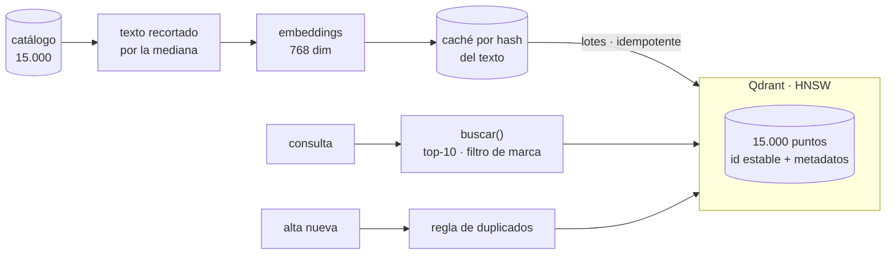

# Aurum Market · Motor de descubrimiento y control de catálogo

**Informe de evaluación — Bases de Datos Vectoriales**
Raúl Sánchez Serrano · `Repositorio: https://github.com/RaulRX/aurum-market-catalog`

---

## 1. El problema

Aurum Market tiene quince mil referencias en español que aportan vendedores distintos, y dos averías que vienen del mismo sitio: el sistema entiende palabras, no intenciones.

La primera es de cara al cliente. Alguien que busca *"algo para tapar la ventana y que no entre luz por la mañana"* no escribe ninguna de las palabras con las que el vendedor tituló su producto —"estor", "opaco", "blackout"— y se marcha sin encontrarlo, aunque el catálogo lo tenga. La segunda es interna: llegan fichas con el título reordenado o la marca omitida, nadie detecta que ya existen, y el mismo producto acaba publicado dos veces ensuciando los resultados de todos los demás.

Conviene decir desde el principio que el catálogo está sucio, porque eso ha condicionado casi todo lo que viene después. Un 4,4 % de los productos no tiene marca y un 37,4 % no tiene color, así que ninguno de los dos campos puede ser un requisito duro en ninguna regla. Hay 9.054 marcas distintas para quince mil productos —menos de dos productos por marca—, lo que convierte la marca casi en un identificador: Einhell, por ejemplo, son treinta productos, un 0,2 % del catálogo. Y el campo de texto tiene una mediana de 936 caracteres pero llega a tres mil, casi siempre por repetición de palabras clave puestas ahí para posicionar.

El encargo pide una primera versión que se pueda mantener, no un prototipo, y excluye expresamente usar un modelo generativo para resolver, etiquetar o reordenar consultas. Todo el trabajo se ha hecho en un portátil de cuatro núcleos, con ocho gigas de RAM y sin tarjeta gráfica. Eso no es una disculpa: ha descartado opciones reales y se cuenta como lo que es, una restricción de despliegue.

---

## 2. Qué se probó y qué se descartó

El método ha sido siempre el mismo: cambiar una cosa cada vez, con el mismo protocolo, y **dejar escrito el criterio de decisión antes de mirar el resultado**. Tres decisiones se fijaron deliberadamente a ciegas —el desempate entre modelos, el límite de negocio del índice y el criterio del umbral de duplicados— porque un umbral que se elige después de ver la curva ya no juzga el resultado: lo describe.

**La referencia.** Antes de justificar el coste de nada hacía falta saber contra qué comparar, así que se implementaron dos baselines léxicos sobre el mismo tokenizador. BM25 dejó el listón en 0,51 de nDCG@10, nueve puntos por encima de TF-IDF, porque trata la longitud del documento de otra forma y en este catálogo la longitud varía muchísimo. Ese número es el que el sistema denso tenía que superar para merecer su coste.

**El modelo.** Se compararon tres candidatos con el texto congelado, para no mezclar dos ejes. Ganó `gemini-embedding-2`, y la diferencia decisiva no fue de calidad sino de tiempo: codificar mil quinientos productos le cuesta menos de un minuto, frente a la hora y media de `jina-v3` y las casi cinco horas de `granite`. Eso puede parecer comodidad, pero fue lo que hizo posible barrer después siete formas distintas de componer el texto. Con un modelo local ese barrido habría costado días, probablemente no se habría hecho, y de ahí salió la mejor decisión del proyecto. `jina-v3` tenía además una licencia no comercial que lo habría descartado igualmente para producción, aunque hubiera ganado.

**El texto que se codifica.** Aquí estaba la pregunta interesante: ¿sobra la mitad más larga de cada ficha? La respuesta medida es que sí. La plantilla ganadora recorta el texto por la mediana del propio corpus —936 caracteres— y bate tanto al texto íntegro como a las versiones cortas de solo título o solo campos etiquetados. Lo que se corta es relleno comercial. El punto de corte no lo eligió nadie a dedo: se deriva de los datos, así que la decisión es reproducible y no depende de que alguien acierte con un número. Se descartó trocear los productos en fragmentos porque con la ventana del modelo elegido no hay truncado real que resolver, y habría complicado la idempotencia y la detección de duplicados sin arreglar ningún problema.

**El motor.** Tres candidatos pasaron el mismo guion de diez pasos: crear, ingerir, repetir la ingesta, buscar, filtrar, leer por identificador, borrar, reiniciar el contenedor, apagarlo y medir memoria. Ganó Qdrant, y el motivo fue el color. Como en este catálogo el color es texto libre, filtrar por él exige buscar dentro de un campo de metadatos, y Chroma no distingue eso de buscar en el documento entero: devolvería productos cuyo título dice "negro" pero cuyo color es otro. No alcanza menos, alcanza mal. Entre los que sí pueden, Qdrant casa palabras completas: pedir "rosa" devuelve doscientos cincuenta y dos productos sin arrastrar los veintiocho que solo contienen "rosado" u "oro rosado". Weaviate cumplía pero sin ventaja medida, y Milvus son tres contenedores en una máquina de ocho gigas. A pgvector no lo descartamos, lo aplazamos: cumple todo, pero convertiría el payload en columnas y reabriría decisiones ya cerradas.

Donde el motor elegido pierde es en el trato de los errores: con el servicio caído levanta una excepción del transporte y no una propia del SDK, así que la capa de búsqueda tiene que envolver los dos casos.

**Los duplicados.** La regla combina el parecido del texto con el margen respecto al segundo candidato, y admite una segunda vía cuando coincide la marca o el color. Se descartó añadir una comparación léxica de títulos porque el modelo ya cubre el caso de títulos reordenados y meter un cuarto parámetro con solo catorce ejemplos era invitar al sobreajuste. Y se eligió que marca **o** color corroboren, en lugar de exigir ambos, por una razón de negocio: el mismo producto en otro color sigue siendo un duplicado.

---

## 3. La arquitectura

Tres decisiones sostienen el conjunto, y las tres responden a un problema concreto en lugar de a una preferencia.

La primera es usar como identificador del punto el UUID estable que ya trae el dataset. Eso hace que **repetir la ingesta completa no cree ni un solo producto duplicado**, porque escribir sobre el mismo identificador sobrescribe. Es idempotencia gratis, y con un identificador autoincremental habría que haberla construido a mano.

La segunda es que la caché de vectores lleva el texto en la clave. Cambiar la forma de componer el texto la invalida sola, de modo que es imposible servir vectores de una receta contra un índice construido con otra.

La tercera es que el nombre de la colección lleva dentro el contrato: modelo, plantilla y dimensión. Cambiar cualquiera de los tres crea una colección distinta en vez de contaminar la existente, y eso convierte una futura migración en "construir al lado y mover el puntero" en lugar de "reindexar sobre lo que está sirviendo".

Los metadatos guardados son los que alguien necesita después: identificador comercial, título, marca, color, versión y estado. No se guarda el texto largo, porque su significado ya está en el vector y copiarlo solo serviría para reconstruir el índice sin el fichero original. Los huecos se guardan como valor vacío en lugar de omitir el campo, lo que permite listar los productos sin marca; a cambio, un filtro construido sin validar la entrada dejaría de filtrar sin avisar, y por eso la validación es explícita.

---

## 4. Qué ocurrió

**El sistema denso justifica su coste.** Sobre las ocho consultas con juicios de relevancia, gana algo más de nueve puntos de nDCG a BM25 y casi duplica el recall. Pero el número que mejor cuenta la historia es otro: la posición del primer acierto pasa de 0,75 a 0,94. El buscador denso no solo encuentra más cosas relevantes, **las pone antes**, que es lo que nota un cliente.

| | nDCG@10 | Recall@10 | MRR@10 | p95 |
|---|---:|---:|---:|---:|
| TF-IDF | 0,41 | 0,15 | 0,75 | — |
| BM25 | 0,51 | 0,18 | 0,75 | — |
| Denso, búsqueda exacta | **0,60** | **0,29** | **0,94** | — |
| Denso, índice entregado | 0,55 | — | — | 11,1 ms |

**Los filtros, las mutaciones y los duplicados funcionan.** Las cuatro consultas con restricción de marca devuelven el cien por cien de resultados de la marca pedida, y el filtro lo ejecuta la base de datos, no un descarte posterior en Python —que con Einhell al 0,2 % del catálogo habría devuelto cero resultados—. Los veinticuatro eventos del ciclo de vida dejan el catálogo exactamente en quince mil productos, y repetirlos entero lo deja igual. La regla de duplicados separa perfectamente los catorce casos de desarrollo.

Sobre esto último conviene ser honesto: **una separación perfecta no demuestra que la regla generalice**. Los siete positivos del conjunto son reenvíos casi literales y los siete negativos son productos de categorías completamente distintas. No hay ni un caso limítrofe, que es justamente donde una regla de este tipo se rompe. Los casos difíciles —la misma prenda en otra talla, el mismo producto de otro vendedor— no están probados porque el conjunto no los contiene.

También merece explicarse por qué la regla prioriza no dejar escapar duplicados aunque eso cueste alguna falsa alarma. Los dos errores no cuestan lo mismo: una falsa alarma se resuelve con una revisión manual en el momento del alta, mientras que un duplicado que se cuela degrada el catálogo de forma **silenciosa y permanente**, porque nadie vuelve a auditar lo que ya está publicado.

**Dónde falla el sistema, y por qué.** Se eligieron tres fallos representativos, uno por cada capa donde puede originarse un problema.

El primero es de **índice**: hay una consulta sobre botines de mujer cuyo mejor resultado, según la búsqueda exacta, el índice aproximado no encuentra en absoluto. No es un error del modelo —el modelo lo coloca primero— sino del atajo que usamos para no comparar contra los quince mil vectores en cada consulta. La causa es que esa categoría ocupa una zona muy densa del catálogo, y explorando pocos candidatos el recorrido se gasta en vecinos próximos pero no óptimos.

El segundo es de **representación**: la consulta de sillas de oficina devuelve catálogos casi disjuntos según se escriba con palabras clave o parafraseada. Al reformularla sin las palabras exactas, entre los primeros resultados aparece una silla de ducha. La causa es la forma de componer el texto, y está medida: con otra plantilla y más dimensiones, el solapamiento entre ambas formulaciones sube de 0,05 a 0,82.

El tercero es de **datos**: la consulta de disfraces de hombre tiene métricas malas, pero no por culpa del sistema. El catálogo contiene veintidós disfraces masculinos y **ninguno entró en el conjunto de productos que alguien llegó a juzgar**. Su único producto marcado como coincidencia exacta es una blusa de mujer. Ahí la métrica está midiendo la cobertura del etiquetado, no la calidad de la búsqueda.

**Y dos fallos resultaron no serlo.** Al investigar por qué el índice no mejoraba salió a la luz un defecto de nuestra propia medición: la búsqueda exacta contra la que comparábamos se construía sobre el catálogo anterior a los eventos, mientras que el índice ya los tenía aplicados. Los dos tenían quince mil productos, pero no los mismos. Y varias de las altas nuevas responden literalmente a consultas de prueba —una se titula igual que la consulta— así que el índice las devolvía y nosotros lo apuntábamos como si hubiera perdido algo. Corregida la comparación, **el 61 % de la pérdida que atribuíamos al índice no existía**. La cifra corregida coincide exactamente con la que se había medido tres pasos antes, cuando aún no había ninguna mutación, y esa coincidencia es la mejor prueba de que el problema estaba en la medición y no en el sistema.

**Un último hallazgo, el más incómodo.** Para la demostración final se añadieron tres consultas escritas a mano, que no salen de ningún fichero y no intervinieron en ninguna decisión. Dos de las tres se degradan con la configuración que entregamos, y una lo hace de forma severa: la de las cortinas recupera uno de cada diez resultados correctos y su primera respuesta es un soporte de aire acondicionado.

Tardó en verse porque el síntoma va al revés de lo esperable. Mientras el motor no ha terminado de construir su índice, busca recorriéndolo todo, que es exacto; las primeras pruebas salían bien **precisamente porque el índice no estaba listo**. Solo al asegurarnos de que sí lo estaba apareció el comportamiento real. Eso convierte el fallo de los botines, que habíamos anotado como un caso aislado y explicado, en un patrón: no era una rareza del conjunto de desarrollo, y las tres instancias apuntan al mismo remedio.

---

## 5. La decisión recomendada

Se entrega el sistema exactamente como se decidió, sin reabrir nada a la vista de los resultados, porque hacerlo invalidaría el método con el que se decidió. Pero el trabajo deja dos mejoras medidas que no se han aplicado, y la primera merece una recomendación clara.

**Lo que hay que cambiar no es el valor del parámetro del índice, sino el criterio que lo eligió.** La regla fue quedarse con la configuración más barata de entre las que cumplían el límite de negocio, y por eso ganó la que ganó. Mirando la comparación con calma, esa elección se sostiene sobre **medio milisegundo** de diferencia frente a una alternativa más exhaustiva. Y a cambio de ese medio milisegundo, el peor caso por consulta pasa de recuperar el 90 % de los resultados correctos a recuperar **ninguno**. El criterio optimizó una media mientras el peor caso se hundía, y el peor caso es exactamente el cliente que se va sin comprar. Una regla que hubiera mirado el mínimo por consulta en lugar de la media habría elegido una configuración más exhaustiva **sin salirse del límite que la propia empresa había fijado**. Es un parámetro de consulta: no obliga a reconstruir nada.

**La segunda mejora tiene más coste y menos urgencia.** La forma de componer el texto se eligió midiendo consultas escritas como palabras clave, que es como está redactado el conjunto de desarrollo pero no como escriben los clientes. Cuando se mide la robustez frente a la paráfrasis, otra plantilla gana con claridad. Aplicarla obliga a volver a codificar y reingerir el catálogo entero, así que es una decisión para la siguiente iteración, no un ajuste.

Queda también un defecto detectado y no corregido, que se declara por transparencia: cuatro de los productos actualizados durante la prueba del ciclo de vida se indexaron con el texto sin recortar, a diferencia de los otros catorce mil novecientos noventa y seis. Son cuatro puntos de quince mil y no alteran ninguna conclusión, pero es una inconsistencia real.

---

## 6. Qué cambiaría al crecer el catálogo

Nada de lo anterior es una respuesta para quince millones de productos. Estos son los puntos por donde el diseño empezaría a romperse, en el orden en que lo haría.

**Lo primero en romper no sería el índice, sino el criterio con el que lo configuramos.** Ya está roto a quince mil: una de cada tres consultas escritas a mano se degrada. Con un catálogo mucho mayor las zonas densas son más densas y más numerosas, así que ese problema afectaría a más consultas, no a menos. Y aparecerían parámetros que aquí ni siquiera se barrieron porque no hacía falta —los que gobiernan cómo se construye el grafo, no cómo se consulta—, con el agravante de que tocarlos obliga a construir una colección nueva y no admite ajuste en caliente.

**La ingesta dejaría de caber en una máquina.** Quince mil vectores son cuarenta y seis megas y caben en memoria sin pensarlo. Quince millones son cuarenta y seis gigas y no. Eso obliga a repartir la colección, y sobre todo hace desaparecer una comodidad de la que ha dependido medio proyecto: hoy el índice se puede tirar y rehacer en minutos, y por eso hemos podido experimentar con libertad. A esa escala, migrar deja de ser opcional y pasa a ser el único camino posible — que es justamente para lo que el nombre de la colección ya lleva el contrato dentro.

**Perderíamos la herramienta con la que diagnosticamos.** Toda la atribución de errores de este informe se apoya en poder comparar contra una búsqueda exhaustiva sobre los quince mil vectores. A escala eso no se puede hacer cada vez que se investiga un fallo. Habría que mantener un conjunto de consultas de control con su respuesta correcta calculada periódicamente fuera de línea, y aceptar que la fidelidad del índice se mide por muestreo y no de forma completa.

**Pero el cuello de botella real sería la evaluación, no el volumen.** Doscientos cuarenta y ocho juicios humanos ya se quedan cortos para quince mil productos, y se quedarían mucho más cortos para más. Se ve hoy mismo en la consulta de los disfraces: el catálogo tiene la respuesta y el conjunto de juicios no la contiene, así que la métrica mide el etiquetado en lugar del sistema. A escala, sostener una evaluación honesta exige ampliar los juicios de forma continua y complementarlos con señales implícitas —qué se pulsa, qué se compra—, porque el etiquetado manual no crece al ritmo del catálogo.

**Los filtros escalarían mal por cardinalidad.** Con menos de dos productos por marca, la marca ya es casi un identificador. Multiplicar el catálogo multiplica ese problema, y el índice sobre el campo de marca —que hoy es una optimización— pasaría a ser imprescindible. El color necesitaría además una normalización real en el origen: con más de un tercio de valores vacíos y entradas como *"Negro Black 333824 067"*, hoy solo se sostiene como filtro auxiliar.

**Y la regla de duplicados necesitaría datos que hoy no existen.** Está calibrada con catorce ejemplos, y su segunda vía no llegó a activarse ni una sola vez por sí sola: sus umbrales se fijaron razonando, no midiendo. Con un catálogo mayor entran las variantes reales que el conjunto de desarrollo no contiene, y ahí el margen respecto al segundo candidato dejaría de ser una precaución para convertirse en la señal principal.

---

## Anexos

**A · Registro de decisiones.** Las veintidós decisiones de diseño y las cinco que dictó el experimento están en `config/config.yaml`, cada una con su valor, su evidencia y su razonamiento, junto con las limitaciones declaradas y el trabajo de verificación posterior.

**B · Artefactos de resultados.** `resultados/resultados_busqueda.csv`, `resultados/resultados_duplicados.csv` y `resultados/metricas_desarrollo.json`, más la tabla comparativa en `artifacts/tabla_comparativa.md` con su nota al pie sobre la fila del índice.

**C · Evidencia por experimento.** `artifacts/` conserva el perfilado, el baseline, las comparativas de modelos, plantillas y motores, el barrido del índice con sus latencias y la traza de los veinticuatro eventos.

**D · Reproducibilidad.** El recorrido completo —preparar, ingerir, consultar, mutar, volver a consultar, comparar y limpiar— está en `notebooks/10_entrega.ipynb`, que trabaja sobre su propia colección y no toca el índice de producción. Instrucciones y comandos, en el `README.md`.
